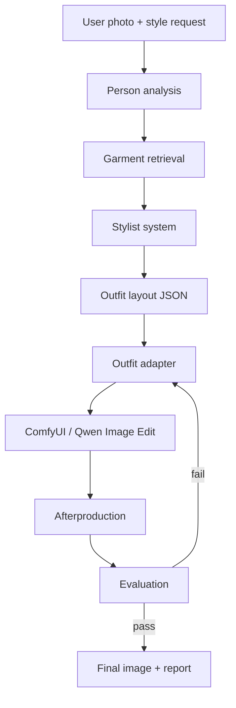

# Architecture

## Product Shape

The system should behave like an automatic stylist plus outfit transfer pipeline.
It must preserve the person while changing clothing according to a concrete outfit plan.

The core rule: selection and rendering are separate.

- The stylist chooses the outfit.
- The adapter translates that outfit into generation instructions.
- The try-on engine edits the image.
- The evaluator decides whether the result followed the plan.

## Data Flow



## Module Boundaries

### 1. User Input

Inputs:

- person image;
- style request;
- optional constraints: budget, colors, season, dress code, disliked items;
- optional garment catalog or uploaded garment references.

Output:

- normalized request JSON.

### 2. Person Analysis

Purpose: describe the source image without changing clothing.

Use:

- Qwen2.5-VL or another local VLM for visual description;
- SAM2 for person/clothing segmentation if masks are needed;
- OpenPose or DWPose for pose and body layout;
- optional face embedding only for evaluation, not public display.

Output:

- identity-preservation notes;
- body and pose constraints;
- visible hair, skin tone, accessories;
- photo quality and framing warnings.

### 3. Stylist System

Purpose: choose specific garments and explain how they should be worn.

It should not emit a pretty paragraph. It should emit an `outfit_layout` object with:

- garment items;
- reference image ids;
- color/material/detail requirements;
- layering rules;
- visibility rules;
- forbidden changes.

Use retrieval from a local catalog:

- Qdrant or FAISS embeddings;
- metadata filters for season, budget, availability, color, dress code.

### 4. Outfit Adapter

Purpose: convert `outfit_layout` into stable Qwen Image Edit instructions.

The adapter must not invent garments. It can only:

- compress wording;
- order instructions by visual priority;
- add preservation constraints;
- add negative constraints;
- prepare reference image order.

### 5. Try-On Engine

Recommended open source path:

- ComfyUI as the workflow runner;
- Qwen-Image-Edit-2511 as the main image edit model;
- optional LoRA/accelerated variants only after the baseline is reliable.

Qwen-Image-Edit-2511 is useful here because its current documentation emphasizes better character consistency and image-drift mitigation compared with older Qwen edit versions.

### 6. Afterproduction

Purpose: repair details lost during generation.

Possible passes:

- localized inpainting for buttons, seams, hems, jewelry, prints;
- color/material correction;
- face/hand cleanup if needed;
- upscaling after the image passes semantic checks.

### 7. Evaluation

Checks:

- same person;
- face and body shape preserved;
- all intended garments present;
- layering logic followed;
- colors/materials/details preserved;
- no unwanted wardrobe items added;
- image quality acceptable.

This should produce a structured `evaluation.json` with pass/fail flags and retry instructions.

## MVP Build Order

1. Define schemas and prompts.
2. Create a manual garment input flow with uploaded garment images.
3. Build adapter prompt and ComfyUI call.
4. Add evaluator with a checklist.
5. Add retry loop with targeted fixes.
6. Add catalog retrieval after the controlled workflow works.

## Recommended Repo Structure

```text
open-source-stylist/
  configs/
  docs/
  prompts/
  schemas/
  src/open_source_stylist/
    api/
    pipeline/
    adapters/
    evaluators/
    storage/
  workflows/comfyui/
  data/
    inputs/
    outputs/
```

## Hard Product Rules

- Do not let the adapter choose fashion.
- Do not let the stylist write generation prompts directly.
- Do not accept a generated image without evaluation.
- Do not optimize for speed before preserving identity and outfit logic.
- Keep every run reproducible: model versions, seed, prompt, references, and evaluation must be saved.

