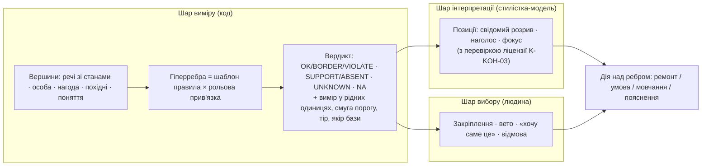

# Гіперграф образу Люстерка — архітектурна записка (незалежний варіант Opus)

**Доручення:** `hypergraph-architecture-20261007-opus` (власник 07.10.2026; запуск підтверджено 08.10 словом «запускай»).
**Характер:** архітектурне дослідження й пропозиція (review/proposal). Це **не** прийняте продуктове рішення
і не зміна продукту: у гілці лише нові файли в `аудит/гіперграф_opus/`.
**Спільна база порівняння:** commit `e70c3c3bcf3161991d4603106c65696ce4592d67` (збірка 2026-10-03 00:02).
Усі якорі `файл:рядок` нижче — на цьому commit, якщо не сказано інше.
**Незалежність:** чужого проєкту не бачив, з іншою моделлю не контактував.

**Де лежить і як дістати**

| Що | Шлях у гілці `claude/hiperhraf-opus` |
|---|---|
| Ця записка | `аудит/гіперграф_opus/ЗАПИСКА.md` |
| Ядро прототипу (без залежностей; CPython 3.10+ і Pyodide 0.26) | `аудит/гіперграф_opus/прототип/ядро.py` |
| 12 зразкових шаблонів гіперребер | `…/прототип/шаблони.py` |
| 4 розібрані приклади (синтетика, позначено SYN) | `…/прототип/приклади.py` |
| Перевірки інваріантів I1–I4 | `…/прототип/перевірки.py` |
| Заміри складності | `…/прототип/заміри.py`, прогін у Pyodide — `…/прототип/pyodide_прогін.mjs` |
| Порівняння з чинним `джерела/graph.py` і попарною моделлю | `…/прототип/порівняння.py` |
| Справжні виводи всіх прогонів | `…/прототип/результати_прогонів.txt` |

Доступ: `git fetch origin claude/hiperhraf-opus && git checkout claude/hiperhraf-opus`, далі
`cd аудит/гіперграф_opus/прототип && python3 приклади.py` (решта — так само; `порівняння.py` імпортує
справжній `джерела/graph.py` бази лише для читання).

**Стан на старті й наприкінці** — §12. Модель, зусилля й usage — у підсумковому рядку сесії: правило
середовища забороняє вписувати ідентифікатор моделі в артефакти репозиторію.

---

## 0. Коротко

1. **Що є.** У коді два різні «гіперграфи». `джерела/graph.py` будує граф **уже видаданих знахідок**
   суду над образом моделі (`суд_від_моделі.py:1846`) і віддає моделі лише «вузол напруги» у вердикті
   ремонту (`дріт_моделі.py:1097-1100`). `джерела/hypergraph.py` — окремі багатовузлові ребра **тіла** для
   брифу (`brief.py:1153-1160`), з яких до промпту складання доходять три коди. Образ складає модель
   (`композитор_збирання.py:444-461`: «КОД ОБРАЗІВ НЕ ЗБИРАЄ»).
2. **Головний розрив.** Ребро існує лише тоді, коли правило «подало голос». «Перевірено й добре»,
   «не перевірено, бо бракує входу» і «не застосовне» не мають представлення. Учасники ребра частково
   вгадуються з тексту. Різнорідні сили складаються в одну напругу. Позитивні взаємодії або відсутні,
   або потрапляють у напругу **з плюсом** — як проблема. Немає поняття закріпленої речі, ролі, стану
   речі як операції, інкрементальності. На прикладі 3 чинний граф називає вузлом напруги **її власні
   закріплені черевики** (напруга 1,00), бо закріплення він не бачить (§6.3).
3. **Що пропоную.** **Доказовий рольовий гіперграф (ДРГ)**: вершини — речі (зі станами), особа,
   нагода, похідні величини; гіперребро — екземпляр **шаблону правила** з **рольовою** прив'язкою
   учасників; правило міряє величину **у власних одиницях** і порівнює її інтервально зі **смугою
   порогу** з бази знань. Вердикти тризначні з окремими станами: OK / BORDER / VIOLATE для обмежень,
   SUPPORT / BORDER / ABSENT для позитивних взаємодій, UNKNOWN (бракує входу) і NA (не застосовне).
   Над вимірами лежать два окремі шари: **позиції стилістки** (свідомий розрив із перевіркою ліцензії
   K-KOH-03) і **вибір людини** (закріплення, вето, «хочу саме це»). Вони міняють дію, а не вимір.
   Між правилами нічого не сумується. Ремонт — лексикографія за класами доменів; компроміси — фронт
   Парето; вибір лишається за стилісткою й людиною.
4. **Математика без маскування.** Звукова інтервальна класифікація: OK/VIOLATE лише тоді, коли
   висновок однаковий для всіх допустимих значень входів і порогу. Невідоме = уся область; якщо
   висновок від нього не залежить, питати не треба. Ймовірнісного змісту жоден бал не має. Множинні
   ефекти (рівно один фокус, кількість кольорів, видимість під пальтом) **доведено** не зводяться до
   попарних (§4.3).
5. **Перевірено на прототипі.** I1, звуковість: 0 суперечностей на 15 685 перевірках екземплярів
   проти точкових підстановок. Перша версія мала 23 суперечності — так знайдено змішування
   «невизначеності» з «діапазоном» в ошатності (§4.1). I2: інкрементальна заміна = повна перебудова,
   0 розбіжностей на 3 600 кроках. I3: правила позицій. I4: детермінізм. Заміри в справжньому
   Pyodide 0.26.4 — §8.
6. **Мінімальне корисне ядро** (§9). Знахідка несе виміряну величину, поріг і **рольових учасників**
   кодами (не з тексту). Суд пише «реєстр доказів» з OK/UNKNOWN/NA для вибраних правил. Вузол напруги
   замінюється **ручками ремонту**, що знають про закріплення. Позиція стилістки перестає множити
   силу на 0.6. Намір стає **параметром** правила, а не множником ½. Усе це — у тіньовому режимі
   до перевірки за §7.
7. **Чого не будувати:** нейромережі на гіперграфі, універсального балу краси, перебору каталогу,
   «ймовірностей» без калібрування, окремої графової БД, нових заборон, бонусів за когерентність (§9.5).

---

## 1. Поточний стан і розрив із задумом

Позначення джерела якоря: **[о]** — прочитано особисто в цій сесії; **[ч]** — прочитано субагентом
лише для читання (`Explore`) з номерами рядків, вибірково звірено. Якщо якір не позначено, він [о].

### 1.1 Два «гіперграфи» і хто їх кличе

**A. `джерела/graph.py` — гіперграф знахідок над слотами й зонами** [о, увесь файл]

- `граф(знахідки, речі)` (`graph.py:200-240`): ребро — знахідка з `правило`. Його вузли — слоти названих
  речей плюс зони тіла, знайдені **підрядком у тексті** `суть`/`чому` (`graph.py:190-193`). Ребро над
  «усім» (≥ n−1 слотів і ≥ 3) згортається у вузол «образ» (`graph.py:184-187`). Без вузлів ребро
  падає в «людина» (`graph.py:194-196`).
- Напруга ребра (`graph.py:225`): блокер = 1.0; питання або `сила_нп=None` = 0; інакше `сила_нп`.
  Напруга вузла = Σ напруг ребер / |вузли ребра| (`graph.py:233-235`). Сортування за
  (−напруга, −ребер, **ім'я вузла**) (`graph.py:239`).
- `вузол_напруги` (`graph.py:246-257`) — перший вузол-слот із додатною напругою. `рядок_вузла` і
  `заяви_вузла` (`graph.py:296-377`) кажуть, «що міняти», за інцидентністю трьох найважчих ребер.
- `розрізнювальні` (`graph.py:261-289`) — правила, чия напруга різниться в пулі.
- `зона(р)` (`graph.py:68-143`) — осі речі як інтервали з джерелом. Колір: L-вікно слова, або
  L ± розкид із фото. C і h у розкид не входять (`graph.py:52-54`).
- **Хто кличе.**
  - `суд_від_моделі.перевірити_від_моделі` (`суд_від_моделі.py:1397`) будує граф **після** усіх
    знахідок, оголошених розривів і відсіву (`суд_від_моделі.py:1846-1849`).
  - Далі шлях такий: `вердикт_моделі.py:1574-1577` [ч] → `дріт_моделі.py:1097-1100`. Модель дістає
    `knot:{statements}`: `tension_knot` + один `change_*`.
  - Підрахунок вузлів також обирає слоти вітрини ремонту й `break_kind` (`повнота_образу.py:164-250`) [ч].
  - `композитор_оцінка.py:297, 451` будує граф **по кожній** з ~200 вибіркових комбінацій. Це лише
    на сміливому намірі (`композитор_збирання.py:333-375`) [ч] і в режимі `вимір`.
- **Розбіжність докстрінга з кодом.** `graph.py:33-38` каже, що вузол іде в «чому цей», портфель O4 і
  пакет моделі. Пакет складання вузла не має: «ГРАФ І ВУЗОЛ ВЛАСНОГО ОБРАЗУ КОДУ БІЛЬШЕ НЕ БУДУЮТЬСЯ»
  (`пакет_моделі.py:1386-1393`). Вузол доходить до моделі лише у вердикті ремонту.

**B. `джерела/hypergraph.py` — ребра тіла для брифу** [о, вибірково 1–240, 373–700]

- `ребра(t, пр)` (`hypergraph.py:492-680`): `баланс_пари`, `мінімум_носіння`, `смуга_прилягання`,
  `якір_обʼєму`, `одна_лінія`, `крій_верх/низ`. Кожне ребро — множина зон тіла й слотів.
- **Напруга ребер** різного походження:
  - Сталі: `мінімум_носіння` = 0.5, `смуга_прилягання` = 0.35.
  - З тіла через рампу з підлогою: `якір_обʼєму` (з WHR) і `одна_лінія` (з розкиду профілю)
    (`hypergraph.py:434-489`).
  - З балу простору кроїв: `крій_*`.
- `оцінка` (`hypergraph.py:133-166`): бал = влучання × (1 − напруга_форми) × (1 − напруга_краю).
  Напруга — «шумове АБО»: 1 − Π(1 − вага_сили · сила_нп) (`hypergraph.py:104-117`), де
  `ВАГА_СИЛИ` = hard .90 / strong .60 / default .40 / soft .25 / hint .12 / питання .05
  (`hypergraph.py:79-80`). Самоперевірка на 5 тілах ≈1000 комбінацій кожне йде 7,97 с CPython (замір
  цієї сесії).
- **Хто кличе:**
  - `brief.py:1153-1160`: `простір(сітка="крої")`, потім `сітка="довжини"`, потім `ребра`, лише якщо
    є тіло (`brief.py:1126`) [ч].
  - Коди `мінімум_носіння` і `смуга_прилягання` знято з брифу (`brief.py:505, 1175`) [ч].
  - `дріт_моделі.py:850-854` відкидає й ті, що «діють у коді» (`pair_*`, `volume_anchor`, `one_line`,
    `no_hem_at`, `top_hem_at`) [ч].
  - До промпту складання доходять лише `cuts_best_on_her`, `cuts_none_scored`, `body_knot` [ч].

**C. Хто складає образ** [о + ч]

- Модель складає з пулу: «КОД ОБРАЗІВ НЕ ЗБИРАЄ. Він дає кандидатів у слоти; образи складає ші»
  (`композитор_збирання.py:444-461`). Задача — `пакет_моделі.СКЛАДАННЯ` (`пакет_моделі.py:467-607`) [ч].
- **Пул:**
  - 17 слотів `міст_пакет.УСІ_СЛОТИ` (`міст_пакет.py:580-582`).
  - Розмір визначає бюджет 120 000 символів на перелік (`пакет_моделі.py:627-642`) [ч]: семплер,
    підлога 20 на слот (`семплер.py:30, 310-417`) [ч].
  - «~425» — середнє аудиту, «405–441» (`аудит/ПЕРЕДАЧА.md:212`) [ч], а не стала коду.
- **Старий перебір лишився в трьох місцях:**
  - режим `вимір=N` (`композитор_полюси.py:30-101`; кличуть лише `run_outfit.py:210-213` і
    `measure_coordination.py:62`) [ч];
  - сміливі наміри: 200 вибіркових комбінацій для вибору слота розриву, ~61 мс на комбінацію,
    ≈12 с на прогін (`композитор_збирання.py:333-375, 452-453`; `композитор_реєстр.py:95`) [ч];
  - ярус 4 ремонту повноти: на «мега-образі» 1 260 варіантів за 149 с, тому стеля 480 речей
    (`повнота_образу.py:949-956`) [о].

### 1.2 Знахідка — фактичний носій «ребра»

- Єдиний конструктор `_зн` (`реєстр_сила.py:332-422`); форма — `протокол.ЗНАХІДКА`
  (`протокол.py:1035-1067`) [ч].
- `_зн` **приймає** `вимір`, `розкид`, `повна`, але **не зберігає** їх. Зберігає лише перетворене
  `сила_нп` + `сила_нп_джерело` (`реєстр_сила.py:356`; збережені ключі звірено [о]). Отже, граф
  будується з чисел, з яких виміряну величину вже не відновити.
- `сила_нп` — суміш трьох речей [ч]:
  - **запас** |вимір − поріг| / масштаб із кліпом до стелі категорії (`реєстр_сила.py:130-210`);
  - **відображення категорії** `_КАТ_У_НП` = hint .25 / soft .5 / default .62 / strong .75 / hard .95;
  - **сталі емітентів**: 168 із 251 викликів `_зн` загорнуті в `dict(_зн(…), сила_нп=X)`.
- Шкал «категорія → число» щонайменше три, і вони різні:
  - `_КАТ_У_НП`;
  - `суд_від_моделі._СИЛА_НП` = .95/.75/.5/.35/.2 (`суд_від_моделі.py:301`) [ч];
  - `hypergraph.ВАГА_СИЛИ` [о].
- **Калібрування на даних немає.** `вердикт_моделі.калібрування()` (`вердикт_моделі.py:1730-1754`)
  ні на що не впливає; у `вердикти.tsv` 4 рядки даних [ч].
- **Регістр** (гейт / репліка / питання) рахує одна таблиця `ПОЛІТИКА_РЕГІСТРУ`
  (`реєстр_політика.py:138-325`). Принцип: гейт — це межа людини або фізика речі
  (`реєстр_політика.py:59-81`) [ч]. Цей принцип пропонована схема **зберігає** як класи PERSONAL/PHYSICAL.

### 1.3 Перевірені розриви (кожен відтворено або прочитано)

Відтворення P1–P6 зроблено **на справжньому модулі** `graph.py` бази. Скрипт —
`прототип/порівняння.py`, вивід — `результати_прогонів.txt`.

| # | Розрив | Доказ |
|---|---|---|
| R1 | **Мовчання = відсутність ребра.** «Перевірено, добре» не має запису; граф без знахідок порожній так само, як граф правил, що не мали входу. | `graph.py:48-51` (сам докстрінг: «мовчання ≠ пройдено»); P4: `[] → вузол None`. База вимагає трьох станів: «*No input*… never counted as *passed*» (тема-4 K-IO-04, L788–790). Частково це закривають чеклісти `суд_образу` (CLAUDE.md п.4), але не граф. |
| R2 | **Учасники з тексту.** Зону тіла знаходить підрядок у `суть`/`чому`. Відмінок чи лапки міняють і вузли, і напругу слота. | `graph.py:190-193`. P1: «край у стегнах» → вузли `[низ]`, напруга 0,50; «край на рівні «стегна»» → `[низ, стегна]`, напруга слота 0,25. Коментарі `верхнє_пропорція.py:230`, `верхнє_стан.py:292-295` [о] показують, що емітенти вже підлаштовують формулювання під цей пошук. |
| R3 | **Колапс у «образ».** Ребро над 3 із 4 слотів стає вузлом «образ», і вузол-слот зникає. | `graph.py:184-187`. P2: `K-X` над верх+взуття+сумка → `['образ']`, вузол напруги `None`. Тристороннє відлуння чи «сирота»-метал губить локальність. |
| R4 | **Сума непорівнянних.** Напруги різних правил складаються у вузлі, хоча докстрінг визнає їх непорівнянність. | `graph.py:46-47` проти `graph.py:233-235`. P6: K-COL-06 0,4 + K-SIL-01 0,6 → вузол «верх» 0,5. База: «no numeric style score» (тема-4 L804, L872); K-COL-CONF «код називає конфлікт, але не арбітрує» (тема-2 L1966–1971) [ч]. |
| R5 | **Позитив як напруга.** K-COL-01 «колона — лишити» (`hint`, `сила_нп=0.25`) — позитивне повідомлення. Воно входить і в суму композитора, і в напругу графа. | `колір_світлота.py:169-182` [о]; `композитор_оцінка.py:205-206` (сума всіх неблокувальних `сила_нп`) [о]; `graph.py:225`. P5: «лишити колону» → вузол «верх» 0,125. Знак K-PAL-16 «схвалено» відкинуто (`композитор_оцінка.py:165-183`) [ч]. Позитивного каналу нема. |
| R6 | **Нічия за абеткою.** Симетричне ребро робить вузлом той слот, чия назва раніша. | `graph.py:239`. P3: K-SIL-01 над верх+низ → «верх» (0,30). Вузол спрямовує ремонт, тож вибір «що міняти» тут довільний. |
| R7 | **Намір як множник.** `statement` множить `сила_нп` чотирьох правил на ½. Точний збіг рядка; це робиться **після** обчислення `сума_сил`; знахідки з відра «акцент» зливаються пізніше й не зачіпаються [ч]. | `суд_від_моделі.py:1795-1801` [о]; злиття `:1829` [о]. База: намір — **перемикач**, що інвертує важелі, а не множник сили (тема-4 K-PER-00 L721–724 [ч]). |
| R8 | **Інтерпретація переписує вимір.** Оголошений «свідомий розрив» множить `сила_нп` на 0,6; оголошення вилучається з прози рядками `СВІДОМО\|НАВМИСНО:`. Розрив без перевірки ліцензії K-KOH-03 «важить менше» — і це те саме число, що вимір. | `розбір_відповідей.py:814, 961` [о]; розбір прози `:813-827` [ч]; застосування `суд_від_моделі.py:1837-1838` [о]. |
| R9 | **Закріплення невидиме графу.** `без_замків` знімає гейт над її річчю, але сила лишається. Граф не знає, що річ закріплена, тож вузол може вказувати на неї. | `річ_з_фото.py:1450-1471` [о: сигнатура; ч: тіло]; `суд_від_моделі.py:1835-1836` [о]. §6.3: чинний граф дає вузол «взуття» (1,00) — її закріплені черевики. |
| R10 | **Немає інкрементальності.** Заміна речі перебудовує весь вердикт. Заміна з фото пробує до 8 запасних, і кожна — це повний суд образу. | `заміна_з_фото.py:53-117` [о: визначення; ч: тіло]; `міст_відповіді.py:1256-1265` [ч]; ярус 4: 149 с на 1 260 варіантів (`повнота_образу.py:949-956`) [о]. |
| R11 | **Частина напруг тіла — сталі або T3-рампи.** Самі сталі з брифу вже знято. | `hypergraph.py:550, 564` (0,5 і 0,35) [о]; знято в `brief.py:505,1175` [ч]; рампи — `hypergraph.py:445-489` [о]. |
| R12 | **Стан речі — не операція.** Видимість під пальтом рахує `outfit.елементи` (верх видно лише з розстебнутим пальтом, площа ×0,35). Граф цього стану не має. Знахідки двох станів не дедуплікуються [ч, висновок читача]. | `outfit.py:394-586` [ч]; база: стан пальта — операція, що перераховує поле біля обличчя (тема-11 K-OUT-09 [ч]). |

### 1.4 Що в чинній системі правильне і переноситься

- **Річ як зона.** Інтервали з джерелом, «нічого не вгадується: невідома вісь відсутня»
  (`graph.py:68-81`). Пропонована схема це **узагальнює** до C і h та до типу інтервалу.
- **Розрізнювальність у пулі** (`graph.py:261-289`) — корисна діагностика «вимір», лишається.
- **«Сила ≤ верифікація»** і тіри T1–T4 (тема-4 L14, L34 [ч]); `ПОЛІТИКА_РЕГІСТРУ` (гейт = межа людини
  або фізика речі). Лягає на класи PERSONAL/PHYSICAL.
- **Внутрішня мова** (`внутрішня_мова.py`: 22 види повідомлень, 937 заяв [ч]) і П-6: модель дістає коди,
  а не фрази (CLAUDE.md п.12). Схема віддає моделі ті самі заяви, лише з ролями й ручками.
- **Рампи тіла з підлогою** (`hypergraph.py:434-489`) — правильна думка: напруга з виміру тіла, а не з
  константи. У схемі це стає вимірами в рідних одиницях (WHR, розкид профілю) зі смугою порогу.
- **Чеклісти «без входу»** (`суд_образу.позначити_без_входу`, `суд_від_моделі.py:1603`) [о] —
  зародок реєстру доказів.

### 1.5 Розрив із задумом власника

| Задум | Що є | Чого бракує |
|---|---|---|
| Вузли й ребра — елементи, правила, концепти образу | Ребра лише з видаданих знахідок; вузли — слоти, зони, «образ», «людина» | Речі зі станами, особа, нагода, похідні, поняття бази як вершини; правила як **шаблони**; ролі |
| Формувати | Модель складає з пулу; граф до складання не доходить (`пакет_моделі.py:1386-1393`) | Обмежений внесок графа до складання: відкриті ролі для закріпленої речі, відомі підтримки (§5.3) |
| Аналізувати | Вузол напруги з сум | Тризначні вердикти з доказом, запасом і причиною межі |
| Пояснювати | `tension_knot` + `change_*` | Підтримки, невідоме з «хто може дати вхід», позиції й умови |
| Ремонтувати | Повний перебір із повним судом | Локальний ремонт в області ребра, інвалідація лише залежного |
| Людина, нагода, намір | Вето як гейт, намір як множник, закріплення через знятий гейт | Класи доменів, застосовність, закріплення як обмеження області, вибір людини як окремий шар |

---

## 2. Порівняння представлень

### 2.1 Критерії (виведені з доручення, бази знань і рішень власника)

- **К1. Багатосторонні взаємодії.** Над множинами, а не лише над парами: «рівно один фокус»
  (K-CRA-02, тема-4 L558 [ч]), бюджет хроми з волоссям і оправою (K-COL-02, L290 [ч]), відлуння в
  ≥ 2 точках (K-COMP-05, L202–205 [о]), видимість під пальтом (тема-11 K-OUT-09 [ч]).
- **К2. Позитивні взаємодії.** Відлуння, доповнення за колом художника (K-COL-03 §4; CLAUDE.md п.18),
  контраст як у неї, якір. Але **без бонусу за когерентність**: «когерентні пари НЕ преміюються —
  це тягне до медіани» (тема-13 K-REG-05, L106 [о]).
- **К3. Невідоме ≠ пройдено** (тема-4 K-IO-04, L788–790 [о]).
- **К4. Контекст і намір як застосовність.** Намір — перемикач, що інвертує важелі (K-PER-00,
  L721–724 [ч]); код нагоди — `hard` там, де його названо (K-KOH-05 [ч]).
- **К5. Пояснення з доказом.** Механізм + умова (тема-6 §4.1 L441 [ч]); ID правила без даних —
  «декоративний слід» (K-IO-05 [ч]).
- **К6. Локальний ремонт та інвалідація залежних висновків.**
- **К7. Потреба в даних для навчання.** Розмічених оцінок майже нема: 4 рядки у `вердикти.tsv` [ч].
- **К8. Обчислюваність у Pyodide** на головному потоці сторінки (`показ.html:10366-10372` [ч]).
- **К9. Сумісність із рішеннями власника.** Без універсального балу (тема-4 L804 [о]); зауваження коду
  — інформація для стилістки (CLAUDE.md п.17); явний вибір жінки сильніший за гейт (п.9).

### 2.2 Кандидати

| Представлення | К1 | К2 | К3 | К4 | К5 | К6 | К7 | К8 | К9 | Висновок |
|---|---|---|---|---|---|---|---|---|---|---|
| A. Плаский список правил + зважена сума (чинний ключ `_оцінити`) | ✗ | ✗ знак губиться (R5) | ✗ | множники ad hoc (R7) | частково | ✗ | не треба | ✓ | ✗ сума | база для порівняння, не ціль |
| B. Попарний граф сумісності, навчений (Bi-LSTM — Han et al., ACM MM 2017; типові вкладення — Vasileva et al., ECCV 2018; NGNN — Cui et al., WWW 2019) | ✗/частково | скаляр | ✗ | ✗ | слабко | частково | **великі розмічені набори**; нашої людини/нагоди там нема | інференс так | ✗ універсальний бал | ні |
| B′. Попарні ручні потенціали + сума (простіша модель для §7) | ✗ (доведено §4.3) | ✓ | ✗ | частково | ✓ | ✓ | не треба | ✓ | ✗ сума | контрольна модель |
| C. Гіперграф знахідок без ролей (чинний `graph.py`) | ✓ інцидентність | ✗ | ✗ (R1) | ✗ | частково | ✗ | не треба | ✓ | частково (сума у вузлі) | основа, яку варто розвинути |
| D. Факторний граф / марківське поле (Kschischang, Frey, Loeliger, IEEE T-IT 2001) | ✓ | ✓ | ✓ маргіналізація | ✓ | середньо | ✓ | **калібровані потенціали**; без них «ймовірності» фіктивні | ✓ для малих n | ✗ доки нема калібрування | структура так, семантика ні |
| E. Зважена / напівкільцева задача задоволення обмежень (VCSP — Schiex, Fargier, Verfaillie, IJCAI 1995; SCSP — Bistarelli, Montanari, Rossi, JACM 1997) | ✓ | як переваги | через інтервали | ✓ | ✓ порушені обмеження | ✓ min-conflicts (Minton et al., AIJ 1992) | не треба | ✓ | ✓, **якщо** поєднання не сумою, а лексикографією чи Парето — SCSP це дозволяє | **ядро** |
| F. Граф знань / онтологія | n-арні через реїфікацію | як факти | відкритий світ | частково | ✓ для понять | ✗ не оцінює | не треба | ✓ | нейтрально | лише як **вершини понять** (кола художника, сім'ї кольорів, реєстри) |
| G. Гіперграфові нейромережі (HGNN — Feng et al., AAAI 2019; HyperGCN — Yadati et al., NeurIPS 2019) | ✓ | скаляр | ✗ | ✗ | слабко | ✗ | **дані + GPU** | інференс так | ✗ | ні |
| H. Аргументаційні рамки (Dung, AIJ 1995; біполярні — Cayrol, Lagasquie-Schiex, ECSQARU 2005; ціннісні — Bench-Capon, JLC 2003) | опосередковано | ✓ підтримка | частково | ✓ цінності й аудиторія | **сильно** | ✗ | не треба | ✓ | ✓ | **шар позицій** (розрив, вибір людини) |
| I. Багатокритеріальність / Парето | ✗ сама | ✓ | ✗ | частково | «що виграно/віддано» | ✗ | не треба | ✓ для малих множин | ✓ | **порівняння варіантів** |
| J. Системи підтримки істинності (JTMS — Doyle, AIJ 1979; ATMS — de Kleer, AIJ 1986) | — | — | — | — | — | **✓ залежності, інвалідація** | не треба | ✓ | ✓ | **індекс залежностей** |

**Вибір.** Беру комбінацію, кожен складник якої відповідає за свій критерій:

- **E** — ядро: гіперграф обмежень і переваг з інтервальними тризначними вердиктами (= факторний граф D
  без імовірнісної семантики);
- **J** — індекс залежностей для інвалідації;
- **H** — шар позицій стилістки й людини;
- **I** — порівняння варіантів;
- **F** — вершини понять із бази знань.

D лишається відкритою **дорогою на потім**: після калібрування окремих шаблонів (§4.9) і лише в
межах каліброваної популяції. B і G — ні. Вони дають універсальний бал, якого власник не хоче. Їм
потрібні розмічені дані, яких нема. А пояснення з них — post hoc, не механізм.

**Чому не «просто факторний граф».** Факторний граф — та сама двочасткова структура (змінні ↔
фактори), але його потенціали множаться й нормуються в розподіл. Тоді кожне число набуває
ймовірнісного змісту, а доручення прямо забороняє приписувати його некаліброваним величинам. Тому
структуру беру, семантику — ні: фактор дає **вердикт і запас у рідних одиницях**, а не потенціал.

---

## 3. Рекомендована схема: доказовий рольовий гіперграф (ДРГ)

### 3.1 Три шари, які не змішуються



**Правило шарів.** Позиція чи вибір **ніколи не змінює виміру**. Вони змінюють **дію** над ребром:
ремонтувати, назвати умову, не чіпати, пояснити як задум. Сьогодні шари змішано: розрив множить
вимір на 0,6 (R8), намір множить його на ½ (R7). Звідси вимоги до пояснення: (а) «код виміряв X»;
(б) «стилістка свідомо обрала Y, бо Z — умови ліцензії такі»; (в) «вона попросила саме це — умова W».

### 3.2 Вершини та ідентичність

| Тип вершини | Ідентичність | Атрибути (кожен — значення + тип + джерело + тір) | Звідки |
|---|---|---|---|
| **Річ** | `item:<id каталогу>` або `own:<id фото>` (її речі мають префікс «її-», `річ_з_фото.py:1311` [ч]) | колір L\*/C\*/h (дуга), слово кольору; тип, крій, тканина/рід (тканий/трикотаж), довжина/край (см від підлоги), формальність (діапазон 1–10), інтерес, об'єм, метал фурнітури, блиск/фактура (0–3), масштаб принту (см) | фід, збагачення, фото |
| **Стан речі** | `item:<id>#<стан>` | застебнуте / розстебнуте / накинуте; заправлене; закатані рукави. Стан — **операція**: міняє видимі площі й поле біля обличчя (тема-11 K-OUT-09; тема-4 K-CRA-05 [ч]) | модель (укладка), код |
| **Слот** | ім'я з `УСІ_СЛОТИ` | обов'язковість, допустимі стани | `міст_пакет.py:580-582` |
| **Зона тіла** | код зони/рівня (`внутрішня_мова` `zone`, `body_level`) | обхват, висота від підлоги, **провенанс** (виміряно / виведено / заявлено) | екран мірок, `areas` |
| **Особа** | `person:<атрибут>` | шкіра L\*, волосся L\*, очі (сім'я, L\*), особистий контраст з σ (`profile.σ_профілю`, `profile.py:61-84` [о]), WHR, зріст, вето (типи/тканини/принти/кольори/зони), `ноги_вище_см`, сенсорні межі | профіль, паспорт |
| **Нагода й намір** | `ctx:<поле>` | поля `СХЕМА_ПАСПОРТА` (`паспорт_нагоди.py:580-645` [о]): ошатність [від, до], рух, погода, тривалість, намір, мета, макіяж, прикраси, бажання | паспорт (мовна модель) |
| **Пул** | `pool:<хеш ключа пакета>` | статистики кандидатів для **відносних до пулу** величин: ранг середньої схожості K-COMP-01 (тема-4 L153 [ч]), ранг масштабу аксесуара (K-ACC-05 [ч]) | `композитор_збирання` |
| **Похідна** | `der:<ім'я>(<залежності>)` | видимі речі й площі за станами; поле біля обличчя; кластери кольору; лінії поділу | обчислюється, кешується |
| **Поняття бази** | `concept:<код>` | пари кола художника (бордо↔хвоя, кемел↔темно-синій, бірюза↔мідь — K-COL-03 §4, CLAUDE.md п.18), сім'ї кольорів, реєстри | база знань, коди внутрішньої мови |

**Тип значення — обов'язкове поле.** Прототип довів, що без нього модель хибна (§4.1, I1).

- `uncertain` — епістемічний інтервал: невідома точка десь у межах. Приклади: L\* зі слова, обхват
  ± похибка.
- `range` — множинний діапазон: річ доречна на всіх рівнях 5–7; нагода приймає 4–6.
- `set` — множина можливих номінальних значень, наприклад метал «золото або невідомо».
- `point` — точне значення.
- Невідоме — `null` з `missing_reason`. Дефолту немає.

### 3.3 Гіперребра: шаблон × прив'язка ролей

**Шаблон правила** (картка; розширює схему правила бази WHEN/FORCE/BREAKS/CHANGES, тема-4 L11–16 [ч]):

| Поле | Зміст | Відповідник у базі / коді |
|---|---|---|
| `id`, `kb` | код правила і якір бази | `K-…` |
| `class` | PERSONAL / PHYSICAL / CONTEXTUAL / STYLISTIC / EXPRESSIVE (§3.5) | `ПОЛІТИКА_РЕГІСТРУ`: гейт = межа людини або фізика речі |
| `polarity` | `constraint` / `support` / `licence` / `structural` | — |
| `roles` | іменовані ролі з кардинальністю: `{accent:1, echoes:1..n}`, `{volume_top:1, volume_bottom:1, anchor:0..n, body:{waist}}` | — |
| `scope` | генератор прив'язок: `item`, `pair`, `set` (одне ребро на образ, ідентичність `(шаблон,*)`), `slots` | — |
| `reads` | поля особи/нагоди/пулу, які читає шаблон — для інвалідації й кешу | — |
| `applies(ctx, intent, person)` | → `yes` / `no` / `unknown` + параметри (напр. ліміт фокусів 1 → 2 за `statement`) | WHEN |
| `measure(binding)` | → значення у **рідних одиницях** (ΔE, см, щаблі, кількість, частка) + винуватці | `вимір` |
| `band` | напрям (`le` / `ge` / `in`) і **смуга порогу** [θ⁻, θ⁺] із тіром і якорем | `поріг`, тір |
| `force` | **порядкова** категорія корпусу (hard…hint) як мітка доказовості, **не число** | FORCE |
| `licence` | умови, за яких порушення читається як задум (K-KOH-03) | BREAKS |
| `handles` | ролі, які можна міняти, і як: заміна, додавання, зміна стану | CHANGES |

**Екземпляр ребра** = шаблон + прив'язка ролей. Ідентичність:

- для `item` і `pair` — `(шаблон, відсортовані id учасників)`;
- для `set` і `slots` — `(шаблон, "*")`, з **винуватцями** в полі виміру. Інакше заміна сторонньої
  сережки «перейменовує» ребро над фокусами, і позиція стилістки над ним сиротіє. Цю ваду знайдено
  на першій версії прототипу: приклад 2а давав ORPHANED замість ACCEPTED.

### 3.4 Типи ребер

1. **Обмеження** (`constraint`): K-FIT-03 край не на найширшому місці; K-OUT-06 драбина припусків
   (база сама називає її «ребром гіперграфа, а не властивістю вузла», тема-11 L168 [о]); вето;
   погода×тканина.
2. **Підтримка** (`support`): відлуння K-COMP-05; доповнення за колом художника; контраст як у неї
   (тема-2 L1720–1724 [ч]); наявний якір. Підтримка **не додається** ні до чого (§4.4).
3. **Ліцензія** (`licence`): умова, що робить порушення задумом. K-KOH-03: розрив один, заякорений
   (повторений або підтриманий фокусом), усе сидить бездоганно (тема-4 L513 [о]). Оголошена колона
   звільняє від «точного збігу» (тема-10 L826–827 [ч]). Оголошений каскад інвертує правило країв
   (K-OUT-04 [ч]).
4. **Структурне** (`structural`): видимість і стан. Пальто застебнуте → ребра пари «верх–низ» NA,
   поле біля обличчя = пальто + шкіра. Це гейтування **третього порядку** (§4.3).
5. **Рольове призначення**: хто фокус, база, акцент, відлуння, якір, «третя річ» (K-CRA-01 [ч]),
   колона. Роль — **мітка інцидентності**, а не тип вершини. Вона буває похідна (код виміряв інтерес)
   або оголошена (стилістка: «акцент — сумка»). Розбіжність похідної й оголошеної ролі — окрема
   заява для моделі.

### 3.5 Класи доменів і хто може що

| Клас | Що це | Приклади | Хто може зняти вимогу дії |
|---|---|---|---|
| PERSONAL | межа, сказана **людиною** | вето типів, кольорів, зон; `ноги_вище_см`; сенсорні межі (K-PER-05 [ч]) | лише вона сама — явним проханням |
| PHYSICAL | фізика речі й тіла | мінімальний припуск, драбина припусків, розмір, погода×матеріал, рух×річ, фактична непрозорість | вона (обираючи ризик) → дія = **умова** (п.17: замша в мокру погоду — з умовою, за сильної непогоди — лише на її прохання) |
| CONTEXTUAL | соціальна доречність нагоди | смуга ошатності, дрес-код, жалоба, табу гостя | стилістка з ліцензією (high-low — не за замовчуванням і ніколи для «бути доречною», тема-4 L518 [ч]) або вона |
| STYLISTIC | естетичні конвенції цілого | фокус, відлуння, кольорова структура, метал, пропорції, matchy | стилістка з ліцензією або вона |
| EXPRESSIVE | виконання наміру й мети | «хочу вразити», «щоб не помітили», «вище», три слова (тема-6 §4.7 [ч]) | вона (намір — її) |

Порядок **ремонту** за замовчуванням: PERSONAL > PHYSICAL > CONTEXTUAL > STYLISTIC > EXPRESSIVE. Це
відкрите рішення власника (§10, О1): під наміром `statement` EXPRESSIVE, можливо, має стояти вище
за STYLISTIC.

### 3.6 Ролі композиції з бази (для шаблонів)

| Роль | Визначення в базі | Арність | Якір [ч] |
|---|---|---|---|
| Фокус (одна точка спокою) | «рівно один фокус; нуль — прісно, два й більше — гамірно»; фокусом може бути сама людина | множина (лічильна) | тема-4 K-CRA-02 L558; тема-6 §3.5 L324 |
| Герой / якір образу | одна виразна річ першою; два герої гасять одне одного; сукня — сама собі якір | множина | K-COMP-02 L187–190 |
| Якір об'єму | талія чи вузькі точки (зап'ястя, щиколотка, шия) при повному об'ємі | річ×річ×тіло | K-SIL-03 L234–236 |
| Відлуння / маршрут | акцент повторено в ≥ 2 рознесених точках, або він єдиний фокус; маршрут ≥ 3 точки | множина ≥ 2 | K-COMP-05 L202–205 [о]; L173 |
| База / акцент | 2–3 базові нейтралі + 1–2 акценти з явними ролями | множина з лічбою | K-COMP-03 L192–196 |
| Третя річ | усі три речі видимі, або деталь у речі замінює шар | множина | K-CRA-01 L541–554 |
| Колона | один тон верху й низу під розстебнутим шаром | 3 речі + стан | K-SIL-07 L250–251 |
| Противага | маса взуття ~ об'єм низу; маса сумки врівноважує низ | пара | K-SHO-02 L435; K-ACC-01 L577 |
| Провідний реєстр / цитата | один жанр веде, друга — цитата (одна на образ) | множина | K-KOH-04 L530; тема-13 K-REG-01/02 |

«Міст», «рамка», «історія» як ролі база не визначає [ч]. Найближче — рятувальні ходи (шарф над
поганим кольором біля обличчя, K-ACC-07; колготи, що несуть ΔL\* до взуття, K-HOS-02). Їх я моделюю
як ручки ремонту, а не як ролі.

---

## 4. Математична специфікація

### 4.1 Області значень і типи

- **Колір.** L\* ∈ [0, 100], C\* ≥ 0, h — **дуга** на колі [0°, 360°). Ахроматичне: C\* < 5 (тема-2
  L572–575 [ч]: опубліковано 5, код має 2,0 — розбіжність).
  - Різниця: ΔE00 — T1 як формула, але лише в області малих різниць ≈ ≤ 5. Реальні пари гардероба
    мають медіану ΔE00 ≈ 35. ΔE00 не метрика: 3 % трійок ламають нерівність трикутника (тема-2
    L291–329 [ч]).
  - Тому для **збігу/відлуння** беру покомпонентні відхилення (Δh дуги, |ΔL|, |ΔC|). Для «майже
    збігу» — межу коробок у Lab (ΔE76, точна для коробок). Перехід на ΔE00 — один рядок; ціна —
    втрата точної межі для коробок.
- **Довжини й обхвати** — см, тип `uncertain` (похибка вимірювання телефоном 0,7–1,2 см, тема-3 §2
  [ч]). Припуски — профіль уздовж тіла, а не скаляр (тема-1 §17.1 [ч]).
- **Ошатність** — **порядкова** шкала 1–10. Різниця — кількість **щаблів**, не метрика. Значення — тип
  `range`. Зв'язок через **розрив множин**:
  gap(річ, нагода) = max(0, нагода.lo − річ.hi).
  Тема-5 VIII доводить, що |a − b| ≤ 2 ⇔ перетин [a−1, a+1] і [b−1, b+1] (L575–576 [ч]).
  - **Знахідка прототипу.** Перша версія віднімала ці діапазони як невизначеності:
    Iv(band.lo − fi.hi, band.lo − fi.lo). Перевірка I1 дала 23 суперечності з точковими
    підстановками, усі тут. Виправлено на розрив множин → 0 (`прототип/шаблони.py`, коментар у
    `_form_measure`).
- **Лічильники** (фокуси, метали-«сироти», шари, кольорові сім'ї) — цілі; інтервал лічби
  [нижня, верхня] при невідомих членах.
- **Частки й нормовані величини** (інтерес 0–1, об'єм 0–1, WHR) — `uncertain`. Шкали інтересу й
  об'єму — **конвенції коду** (SYN у прототипі). Їх калібрують або замінюють вимірами (площа з
  геометрії, `areas`).
- **Номінальні** (тканина, метал, тип) — множини можливих значень.

### 4.2 Функція взаємодії, смуга порогу, вердикт

Для екземпляра ребра e з прив'язкою β:

1. **Застосовність:** A_e(β, ctx, intent, person) ∈ {yes, no, unknown} × параметри π.
   `no` → NA. `unknown` → UNKNOWN з переліком відсутнього.
2. **Вимір:** m_e(β; π) — функція атрибутів учасників у рідних одиницях. Для `uncertain`-входів
   рахується **оболонка** M = [m⁻, m⁺] ⊇ {m_e(x) : x ∈ X}, де X — декартів добуток допустимих
   значень. Монотонні m — інтервальною арифметикою (Moore, *Interval Analysis*, 1966). Немонотонні —
   точними екстремумами (дуга тону), або **зовнішньою** оцінкою (коробка в Lab ⊇ сектор C×h).
3. **Смуга порогу** [θ⁻, θ⁺] — власна розмитість порогу в базі: тір T3, розбіжність джерел. Напрям
   `le` (добре, якщо m ≤ θ) або `ge`.
4. **Вердикт** для обмеження з напрямом `le`:
   - OK ⇔ m⁺ ≤ θ⁻;
   - VIOLATE ⇔ m⁻ > θ⁺;
   - інакше BORDER.

   Для підтримки — SUPPORT, ABSENT і BORDER так само. **Запас** μ у рідних одиницях: θ⁻ − m⁺ для OK,
   −(m⁻ − θ⁺) для VIOLATE, 0 для BORDER.
5. **Причина BORDER**: `input_spread` (M ширша за точку) або `threshold_band` (точковий вимір у смузі).
   Це дві **різні** дії: виміряти точніше або визнати конвенцію розмитою.

**Лема 1 (звуковість).** Нехай M — оболонка, θ ∈ [θ⁻, θ⁺]. Якщо вердикт OK, то ∀x ∈ X, ∀θ:
m_e(x) ≤ θ. Якщо VIOLATE, то ∀x, ∀θ: m_e(x) > θ.

*Доведення:* m_e(x) ≤ m⁺ ≤ θ⁻ ≤ θ. Симетрично для VIOLATE. ∎

**Емпірична перевірка** (`перевірки.py`, I1).

- 150 + 300 синтетичних образів, на кожен 12 точкових підстановок входів і порогу зі смуги.
- Результат: 5 355 + 10 330 перевірок екземплярів, **0 суперечностей**. У Pyodide — 2 060 перевірок,
  0 суперечностей.
- **Ціна звуковості — зайва обережність.** Серед BORDER у 137/284 і 241/572 випадків усі 12 точок
  дали однаковий висновок; частина з них могла б бути рішучою. Це верхня оцінка зайвої обережності:
  12 точок можуть не влучити в незгоду.
- Головне джерело зайвої обережності — коробки замість секторів і ширина вікна слова.

**Лема 2 (вирішено попри відсутність).** Якщо вхід a невідомий, його підставлено всією областю
D_a, і вердикт за лемою 1 рішучий, то він **не залежить** від a. Питати про a заради цього ребра не
треба.

- Прототип позначає це `decided_despite_missing`. Шкіряна сумка за невідомого дощу — OK без питання;
  замшеві черевики — UNKNOWN з `missing=[ctx.precip]` (приклад 1).
- Звідси **формальне правило питань.** Питання про a виправдане ⇔ ∃e: v(e) = UNKNOWN ∧ a ∈ missing(e)
  ∧ class(e) ∈ 𝒬, де 𝒬 — множина класів, заради яких дозволено питати. Пропоную {PERSONAL, PHYSICAL}
  і вузько CONTEXTUAL; це рішення власника (§10, О3).
- Так формалізується п.9 CLAUDE.md: «обов'язкові питання — лише без чого не зібрати».

### 4.3 Багатосторонні ефекти: чому попарного не досить

Нехай φ_i ∈ {0, 1} — «річ i фокусна». Будь-яка функція f: {0,1}ⁿ → ℝ має **єдине** мультилінійне
подання f(φ) = Σ_{S⊆[n]} c_S Π_{i∈S} φ_i (Фур'є-аналіз булевих функцій; O'Donnell, *Analysis of
Boolean Functions*, 2014, §1). «Попарна модель» — функції вигляду
g(φ) = Σ_i u_i(φ_i) + Σ_{i<j} h_ij(φ_i, φ_j), тобто ступеня ≤ 2.

**Твердження.** Для n ≥ 3 точно не подаються попарною моделлю:

1. «Хоча б один фокус» f = 1 − Π(1 − φ_i): коефіцієнт при Π_{i≤n} φ_i дорівнює (−1)^{n+1} ≠ 0,
   тож ступінь n > 2. Отже, «рівно один фокус» (K-CRA-02) теж не подається: його нижня частина
   («нуль — прісно») n-арна. Верхня частина («не більше одного») попарна.
2. **Кількість різних кольорових кластерів** серед n речей. Уже для n = 3:
   distinct = 3 − [a=b] − [a=c] − [b=c] + [a=b=c]·1, і член [a=b=c] — потрійний. Перевірка:
   - коли a = b = c, сума трьох рівностей дорівнює 3 і без поправки дає 0, а не 1;
   - тому потрібен член ступеня 3.

   **Строго.** Для сум функцій щонайбільше двох змінних мішана різниця третього порядку
   D = Σ_{ε∈{0,1}³} (−1)^{|ε|} f(x^ε) тотожно дорівнює 0. Для «кількості різних» на кутах
   a ∈ {1, 2}, b ∈ {1, 2}, c ∈ {1, 3} маємо D = 1 − 2 − 2 − 2 + 2 + 3 + 3 − 2 = 1 ≠ 0.

   Бюджети «≤ 3 сімей кольорів» (K-COMP-03) і хроми (K-COL-02) — множинні.
3. **Гейтування видимістю.** Ребро «верх–низ» діє лише за розстебнутого пальта:
   f = h(top, bottom)·[coat ∉ closed]. На кутах (t₁/t₂, b₁/b₂, closed/open) маємо
   D = ±(h(t₁,b₁) − h(t₂,b₁) − h(t₁,b₂) + h(t₂,b₂)). Це ≠ 0 для будь-якого неадитивного попарного
   правила (саме такі правила й мають сенс: «зіткнення» залежить від **пари**).

∎ (Пункт 1 — ненульовий старший коефіцієнт за єдиністю мультилінійного подання; пункти 2–3 —
ненульова мішана різниця третього порядку.)

**Наслідок для архітектури.** Попарний граф (B, B′) може ці ефекти лише **наближати**. Додавання
допоміжних вершин («є фокус», «видимо») і є перехід до гіперребер. Агрегатори в шаблонах:

- `count` (фокуси, сироти) і `distinct` (кластери);
- `max`/`min` (відлуння: «усі три відхилення малі» = max ≤ θ);
- `span` (розмах L\* біля обличчя);
- `component` (найбільша зв'язна компонента відлунь — для matchy);
- гейтування похідною вершиною видимості.

`max` за парами розкладається попарно лише як max, не як сума. Саме тому чинна сума у вузлі (R4)
спотворює навіть попарно-виражені правила.

### 4.4 Позитивні взаємодії — без бонусів

- **Підтримка** (SUPPORT) **ніколи не додається** до будь-якої суми й не входить у домінування
  варіантів. Підстава:
  - K-REG-05 («когерентні пари не преміюються», тема-13 L106 [о]);
  - обернене U координації — Gray et al. 2014 у базі: форма є, точки нема (тема-4 II.2–II.3; тема-5
    III L325 [ч]).
- **Знахідка прототипу.** Перша версія мала −SUPPORT у векторі Парето. Фронт компромісів прикладу 3
  звівся до **одного** варіанта: коричневі черевики + коричнева сумка + коричневі вельветові штани, з
  трьома відлуннями — рівно та «тяга до медіани/matchy». Після вилучення SUPPORT із домінування
  фронт показує справжній вибір (§6.3).
- Для чого тоді підтримка:
  - **пояснення** — «чому це працює»: механізм + умова;
  - **збереження при ремонті** — кандидат, що ламає наявне відлуння, отримує мітку
    `lost_supports`; це інформація, а не бал;
  - **ліцензія розриву** — заякореність у K-KOH-03 перевіряється наявністю SUPPORT-відлуння в
    учасника розриву (приклад 2а: `anchored: False → True`).
- **Верхня межа координації** — окреме обмеження COMP.MATCHY: «точний збіг — провал» (strong,
  тема-10 K-ACC-10 [ч]); «4+ точки — matchy» без джерела (тема-3 §8 [ч]), тому тір hint/SYN.
  Оголошена колона звільняє через ліцензію (тема-10 L826–827 [ч]).

### 4.5 Невизначеність і відсутні дані

| Ситуація | Що робить ДРГ | Чинна система |
|---|---|---|
| Колір зі слова (вікно 40–60 L\* і 60+ C\*, тема-2 L1689 [ч]) | вимір — оболонка; BORDER з причиною `input_spread`; фото звужує | `розкид` = півширина L-вікна (`graph.py:86-91`); C і h не входять |
| Колір з фото | інтервал ± виміряний розкид (тема-2 R-COL-06: 1,85–7,6 ΔE00 [ч]) | точка, якщо розкид не виміряно |
| Невідомий вхід правила | вся область; рішуче → без питання (лема 2); інакше UNKNOWN з `missing` і `who_can_supply` | ребро мовчить, або питання з напругою 0 |
| Мірка не виміряна | мітка, що залежить від невиміряної зони, — UNKNOWN (тема-1 §17.3: hard [ч]) | частково (`hypergraph.py:69-71`) |
| Тканина невідома | лише біт тканий/трикотаж обчислюваний; решта UNKNOWN | «найімовірніше джерело хибних спрацювань» (`hypergraph.py:62-64`) |
| Межа класів контрасту | дві гілки «на межі», без усереднення (K-CON-01 [ч]) | — |

**Чого не робити.** Не перетворювати інтервали на ймовірності; не множити «впевненість» на силу; не
показувати людині числа малих ефектів (тема-10 K-SHO-04 [ч]).

**Поле `who_can_supply`** для кожного відсутнього входу визначає, хто може дати вхід, і тим самим
маршрутизує питання:

- `scenario` — розмова; лише за лемою 2 і 𝒬;
- `profile` — екран профілю, **не** розмова про сценарій: драпіровку в сценарії не питати ніколи
  (CLAUDE.md п.9);
- `catalogue` — збагачення;
- `photo` — замір;
- `nobody` — лишається в блоці «код не знає».

### 4.6 Застосовність, контекст і намір

- **Намір і мета** — входи застосовності й **параметри**, а не множники сили:
  - `statement` змінює ліміт фокусів 1 → 2 (прототип, приклад 2б: перераховано **1** екземпляр, бо
    лише його шаблон читає `intent`);
  - `fashion_forward` інвертує важелі силуету (тема-4 L223 [ч]) — це полярність, а не ½;
  - `comfort_first` робить сенсорні межі жорсткими.
- **Нагода** дає застосовність кодових правил (K-KOH-05 [ч]) і смуги ошатності. Погода дає
  застосовність фізичних. Сезонна тканина за порушення читається як помилка «навіть у тепловому
  комфорті» (K-MAT-03 [ч]) — це CONTEXTUAL, а не PHYSICAL.
- **Реєстр** параметризує правила (тема-13 [ч]): «мінус один аксесуар» для бохо читається інакше.
- **Глядач** — член моделі (тема-4 XI.1 L607 [ч]), але поля аудиторії в сценарії нема. Відкрите
  питання — §10, О7.

### 4.7 Людина: фізичне й особисте проти контекстної стилістики

**PERSONAL і PHYSICAL — обмеження області** або позначка ризику:

- вето прибирає річ з області слота: «абсолютний фільтр, не вага» (тема-6 §1.4 L87–92 [ч]);
  `profile.ЛЮДИНА_ПИТАННЯ.жорстке_ні` [о];
- закріплення звужує область слота до однієї речі;
- фізичне порушення за її вибором — умова, а не ремонт.

**STYLISTIC і CONTEXTUAL — інформація для стилістки.** Знімаються позицією з ліцензією.

**Особа як учасник ребра, а не параметр:**

- шкіра входить у розмах біля обличчя (прототип COL.CONTRAST_MATCH: поле = речі біля обличчя ∪
  шкіра);
- волосся й оправа — в бюджет хроми (K-COL-02 [ч]);
- очі — перша сім'я палітри (K-PAL-01; CLAUDE.md п.9 [ч]);
- зони тіла — у ребрах якоря й країв.

**Межі даних.** Для глибокої темної шкіри база визнає прогалини:

- витяг із фото гірший;
- допуск ΔE треба множити на ≈ 1,5–1,7;
- дані контрасту — лише для європеоїдних і східноазійських облич (тема-2 R-PC-04/09, L1275 [ч]).

ДРГ показує це як ширший інтервал і UNKNOWN, а не як висновок. Світлі й чисті кольори для неї
доступні як підказка (CLAUDE.md п.18).

### 4.8 Порівняння варіантів без універсального балу

- **Профіль** Π(O) — лічба вердиктів за (клас × вердикт) з урахуванням позицій. Прийнята позиція
  переводить VIOLATE у «без дії», але вимір лишається у звіті.
- **Ремонт** — лексикографічний ранг кандидата заміни:
  (стан цілі, нові VIOLATE за класами в порядку §3.5, втрачені SUPPORT, нові UNKNOWN). Рівний ранг
  означає рівноцінність для коду; вибір — за стилісткою.
  - Приклад 3: `bag_black_gold` і `bag_brown_gold` рівні. Друга здобуває відлуння з її черевиками,
    і це видно як `gained_supports`, а не як бал.
- **Компроміси** — фронт Парето за вектором (VIOLATE × 5 класів, BORDER, UNKNOWN), без SUPPORT.
- **Обмеженість лічби.** Лічба VIOLATE у класі — теж конвенція: усі стилістичні порушення в ній
  рівні. Вона явна й перевірна, на відміну від суми некаліброваних сил. Альтернатива — найгірший
  запас у класі — **непорівнянна між правилами** і тому не годиться.

### 4.9 Що потребує калібрування (усе, що має число)

| Величина | Зараз | Як калібрувати |
|---|---|---|
| Смуги порогів T3 (ΔE «майже збіг», розмах контрасту, ліміти лічби, WHR «вираженої талії», межа об'єму) | конвенції бази / SYN | смуга = розкид джерел. Звуження — лише за людськими вердиктами по осях специфікації, не за SKU (тема-6 Part 9 [ч]) |
| Шкали інтересу й об'єму | конвенції коду | замінити вимірами (площі, контраст речі до сусідів) або відкалібрувати парними порівняннями експертів |
| Нормування запасу всередині правила | масштаб правила | лише для впорядкування **в межах правила** |
| Зв'язок запасу з «стилістка вважає проблемою» | відсутній | після ≥ N вердиктів на правило — ізотонна регресія (Zadrozny & Elkan, KDD 2002) окремо для кожного шаблону й класу контексту. Лише тоді запас стає ймовірністю, і лише для цієї популяції. Каркас уже є: `вердикт_моделі.калібрування` [ч] |
| Порядок класів, 𝒬 для питань | пропозиція | рішення власника |

Жодне число в прототипі не калібровано. Числа прикладів — SYN.

---

## 5. Схеми даних і API

### 5.1 Схеми (JSON; коментарі — пояснення, не частина формату)

```jsonc
// ЗНАЧЕННЯ АТРИБУТА — єдиний носій виміру
{ "v": [35, 50] | "suede" | ["gold", "silver"] | null,
  "kind": "uncertain" | "range" | "set" | "point",
  "unit": "L*" | "C*" | "deg_arc" | "cm" | "step_1_10" | "count" | "share" | null,
  "src": "word_window" | "photo" | "tape" | "declared" | "feed" | "enrich" | "derived",
  "tier": "T1" | "T2" | "T3" | "T4" | "her_word" | "SYN",
  "missing_reason": "not_in_feed" }            // лише коли v = null; дефолтів нема

// РІЧ (стан — частина ідентичності вершини)
{ "id": "item:12345" | "own:її-7", "slot": "верхній_шар", "state": "closed" | "open" | null,
  "pinned": true, "own": true, "attrs": { "L": {…}, "C": {…}, "h": {…}, "formality": {…}, … } }

// ШАБЛОН ПРАВИЛА (картка; WHEN/FORCE/BREAKS/CHANGES бази стали applies/force/licence/handles)
{ "id": "COMP.FOCAL_COUNT", "kb": "тема-4 K-CRA-02 L558; K-INT-04", "class": "STYLISTIC",
  "polarity": "constraint", "scope": "set", "roles": { "focal": "0..n" },
  "reads": ["ctx.intent"], "force": "default", "tier": "T3",
  "band": { "dir": "le", "lo": "params.max", "hi": "params.max", "unit": "count" },
  "licence": ["single_break", "anchored_by_echo", "physical_clean"],
  "handles": [ { "role": "focal", "op": "replace_with_quieter" } ] }

// ЕКЗЕМПЛЯР — рядок «реєстру доказів» (пишеться і для OK, і для UNKNOWN, і для NA)
{ "key": ["COMP.FOCAL_COUNT", "*"],
  "roles": { "focal": ["top_red_satin", "skirt_leopard"] },
  "applies": { "status": "yes", "params": { "max": 1 }, "by": ["ctx.intent=context_optimal"] },
  "measure": { "value": [2, 2], "unit": "count",
               "inputs": [["top_red_satin", "interest", "photo"], ["skirt_leopard", "interest", "photo"]] },
  "band": { "dir": "le", "lo": 1, "hi": 1, "tier": "T3", "kb": "тема-4 K-CRA-02" },
  "verdict": "VIOLATE", "margin": -1.0, "border_cause": null,
  "missing": [], "decided_despite_missing": [],
  "inputs_hash": "…", "revision": 3 }

// ПОЗИЦІЯ (шар інтерпретації або вибору)
{ "key": ["COMP.FOCAL_COUNT", "*"], "ids": ["top_red_satin", "skirt_leopard"],
  "kind": "DELIBERATE_BREAK" | "PERSON_CHOICE" | "EMPHASIS", "actor": "stylist" | "person",
  "reason_code": "person_desire:bold", "status": "ACCEPTED" | "REJECTED" | "VOID" | "ORPHANED",
  "licence": { "single": true, "anchored": true, "physical_clean": true } }

// ВАРІАНТ КОМПРОМІСУ
{ "swaps": { "сумка": "bag_bordo_suede_gold", "низ": "trousers_navy" },
  "vector": [0, 1, 0, 0, 0, 0, 0],            // VIOLATE × 5 класів, BORDER, UNKNOWN
  "gains": ["CRA.METAL_ORPHAN→OK"], "losses": ["WEA.WET_FABRIC→VIOLATE"], "conditions": ["protect_suede"] }
```

### 5.2 API (сигнатури прототипу `прототип/ядро.py`, складність — §8)

```text
build(templates, person, ctx, items)            → H                    O(Σ_t |прив'язки_t|)
evaluate(H, t, binding)                         → Factor               O(вартість виміру)
explain(H)                                      → {supports, tensions(+handles), borders(+cause),
                                                   unknowns(+missing, who_can_supply), stances, coverage}
replace(H, slot, item|None [, want_diff])       → Δ{added, removed, changed}
set_ctx(H, field, value [, person])             → Δ                    лише екземпляри з field ∈ reads
declare(H, kind, tid, ids, reason, actor)       → stance               правила §3.5, лема-перевірка VOID
revalidate_stances(H)                           → stances              ORPHANED / VOID після змін
repair(H, key, pool [, top])                    → candidates(rank, target_after, new_violations,
                                                   lost/gained_supports, target_detail)
tradeoffs(H, slots, pool [, cap, k_per_slot])   → front(vector, swaps)
questions(H, Q)  (у прототипі — через explain) → [(field, who_can_supply, depends_on=[keys])]
```

**Інвалідація — `replace`** (реалізовано, перевірено I2):

```text
replace(H, slot, new):
    old ← H.items[slot];  vis0 ← visible(H)              # похідна вершина: стани, шари
    H.items[slot] ← new;  vis1 ← visible(H)
    dirty ← {old, new} ∪ (vis0 △ vis1)                    # речі, що з'явились/зникли з поля зору
    drop  ← ⋃_{x∈dirty} by_item[x]  ∪  {e : scope(e) ∈ {set, slots}}
    for e in drop: unindex(e)
    for t in templates:
        B ← bindings(t) if scope(t) ∈ {set, slots} else bindings(t, only_with=dirty)
        for β in B: index(evaluate(t, β))                 # ідентичність set-ребер стабільна: (t,"*")
    return diff(snapshot_before, snapshot_after)
```

Інваріант I2: після будь-якої послідовності `replace` і `set_ctx` знімок збігається з повною
перебудовою. Перевірено: 0 розбіжностей на 1 200 + 2 400 кроках (CPython) і на 480 (Pyodide).

**Локальний ремонт — `repair`** (min-conflicts, обмежений областю ребра):

```text
repair(H, e, pool):
    for x in handles(e):                       # винуватці виміру, крім закріплених
        for y in pool[slot(x)] \ H.items:
            replace(H, slot(x), y, want_diff=False)
            rank ← ( state(e′),                              # e′ — той самий шаблон після заміни
                     newVIOLATE[PERSONAL], …[PHYSICAL], …[CONTEXTUAL], …[STYLISTIC], …[EXPRESSIVE],
                     lost_SUPPORT, new_UNKNOWN )
            record(y, rank, gained_SUPPORT, target_detail)   # gained — інформація, не бал
            replace(H, slot(x), x, want_diff=False)
    return sort_by(rank)   # рівний ранг = рівноцінні для коду; вибір — стилістки/людини
```

Розширення поза прототипом:

- операції «додати річ у порожній слот» (пояс, шарф як рятувальні ходи);
- «змінити стан» (розстебнути, заправити) — у прикладі 3а це вже зроблено як заміна вершини стану;
- «2-заміна» в області ребра.

### 5.3 Хто що пише: код, стилістка, людина

| Шар | Хто пише | Поля | Хто бачить |
|---|---|---|---|
| Вимір | код | екземпляри (`verdict`, `measure`, `band`, `missing`, ролі, ручки) | модель — **кодами** внутрішньої мови (без ID правил, Р-1); власник — усе у звіті вердиктів |
| Інтерпретація | стилістка-модель | позиції (`DELIBERATE_BREAK`, `EMPHASIS`, оголошені ролі) **структурно**, у JSON-полі `свідомо` з адресатами-ID, не прозою | код перевіряє ліцензію й статус; людина бачить пояснення задуму |
| Вибір | людина | закріплення, вето, «хочу саме це», відмова, вердикт картки | код — як обмеження області / `PERSON_CHOICE`; модель — як факт; журнал — як розмічений приклад по **осях** специфікації (тема-6 Part 9 [ч]) |

**Внесок до складання (формувати, а не лише судити).** Чинний пакет складання вузла не має
(`пакет_моделі.py:1386-1393`), і правильно: вузол ще нема з чого рахувати. Але дещо ДРГ може дати
**до** складання дешево:

- для закріпленої речі — її попарні SUPPORT/VIOLATE з пулом. Це M5: 872 екземпляри за 12–38 мс.
  Модель дістає «з чим вона відлунює», «з чим метал-сирота», а не вердикт.
- ребра тіла з ручками (`якір_обʼєму` → «потрібен якір: пояс/заправка/звужений низ»), як нині
  `cuts_best_on_her`.

### 5.4 Контракт із мовною моделлю (заяви — коди, не фрази)

```text
tension   {rule, roles{role:[ids]}, handles[ids], margin, unit, tier}     # «що вузько і що міняти»
support   {rule, roles}                                                   # «чому це працює»
border    {rule, roles, cause: input_spread|threshold_band}               # «на межі — бо…»
unknown   {rule, missing[field], who_can_supply: scenario|profile|catalogue|photo|nobody}
stance    {rule, kind, actor, status, licence{single, anchored, physical_clean}}
condition {rule, roles, condition_code}                                   # фізичне за її вибором
```

`tension_knot` + `change_*` (`graph.py:354-377`) замінюються набором `tension` з `handles`. Ручки не
містять закріплених речей. Симетричне ребро дає **обидві** ручки, а не «верх» за абеткою (R6).

---

## 6. Розібрані приклади (синтетика, позначено SYN)

Усі речі, особи й числа — **синтетичні**. Вони показують механіку, а не емпіричні норми. Порядки
величин узято з бази: вікно слова ≈ 15–60 L\*, фото — одиниці. Повні виводи — `результати_прогонів.txt`;
код — `прототип/приклади.py`. Нижче V/B/U/S — лічба VIOLATE/BORDER/UNKNOWN/SUPPORT у профілі.

### 6.1 Приклад 1 — невідомі дані: ні портрета, ні мірок, дощ невідомий

**Вхід.**

- Нагода: офіс удень, ошатність [4, 6]. Намір не названо → `conventional` (припущення коду, як
  `паспорт_нагоди.py:510-515` [ч]).
- Речі:
  - оверсайз-светр молочний (фото, об'єм 0,8);
  - широкі штани темно-сині (**слово**: L 15–30, об'єм 0,75);
  - пояс коньячний (фото, якір);
  - пальто кемел, розстебнуте;
  - сумка коньячна (**слово**: L 35–50), золото;
  - шарф бордо (слово, інтерес 0,75);
  - замшеві черевики чорні (фото), **срібна** пряжка.
- Особа: `contrast_L`, `skin_L`, `whr` — невідомі.

**Результат ДРГ.** 69 екземплярів. Профіль: PHYS U1; STYL V1 B6 U1 S2.

- **TENSION** `CRA.METAL_ORPHAN`: золото ×2 (пояс, сумка) і срібло ×1. Ручка — **лише черевики**:
  винуватець-«сирота», а не всі речі множини.
- **UNKNOWN** `COL.CONTRAST_MATCH`: бракує `person.contrast_L`, `person.skin_L`. `who_can_supply` =
  `profile`, отже в розмові про сценарій **не питати** (п.9).
- **UNKNOWN** `WEA.WET_FABRIC` для **замшевих черевиків**: `missing=[ctx.precip]`.
- **DECIDED** без дощу: шкіряна сумка й вовняне пальто — висновок не залежить від дощу (лема 2), питання
  не потрібне. Тобто питання про погоду виправдане **лише** замшею.
- **BORDER** `COL.NEAR_MISS` (черевики чорні ↔ штани темно-сині): межа [0; 18,7] ΔE76 — `input_spread`
  через вікно слова «темно-синій». Класичне «темно-синє чи чорне?» тут — питання точності входу, а
  не вирок.
- **BORDER** `COMP.ECHO` (пояс ↔ сумка зі слова): [0; 0,87] проти смуги [0,8; 1,1].
- **SUPPORT** `COL.WHEEL_COMPLEMENT` (кемел ↔ темно-синій, коло художника) і `COMP.FOCAL_PRESENT`
  (шарф).

**1а. Сумку зі слова замінено тією самою сумкою, виміряною з фото** (L 40–45).

- Інкрементально переоцінено **24 із 69** екземплярів.
- `COMP.ECHO`(сумка, пояс) BORDER → **SUPPORT**. Фото перетворило «можливо» на «так»: це і є ціна
  вікна слова.

**1б. Пояс прибрано.**

- Переоцінено 6.
- `SIL.VOLUME_ANCHOR`: було OK **попри невідомий WHR** (якір є — WHR не потрібен), стало
  **UNKNOWN** [0,5; 1] з `missing=[person.whr]`. Питання про мірки стає доречним **лише тепер**.
- Після мірки WHR 0,70–0,72 — BORDER з причиною `threshold_band`: питання вже не про дані, а про
  розмиту конвенцію T3.

**Порівняння.**

- **Чинний `graph.py`** на тих самих вимірах (VIOLATE → soft 0,5, BORDER → hint 0,25, UNKNOWN →
  питання): вузол «взуття» 0,62. Рядок: «тримається зв'язкою «взуття» + «низ» — міняти одну річ із
  неї». Тут виміряне порушення («сирота»-метал) **склеєне** з невизначеністю вікна слова («майже
  збіг» із штанами). Обидва невідомі входи в графі мають напругу 0 і в рядок не потрапляють.
- **Попарна модель**: сума −0,24 (два «плюси»), «усе добре». Множинного (метал, контраст, якір, фокус)
  вона не бачить. Невідомий дощ = «сухо».

### 6.2 Приклад 2 — свідомий стилістичний розрив: два фокуси на театр

**Вхід.**

- Нагода: театр увечері, ошатність [6, 8], мряка. Намір `context_optimal`; її слова: «хочу яскраво».
- Речі:
  - червоний атласний топ (інтерес 0,85);
  - леопардова спідниця (0,8);
  - чорні шкіряні чоботи;
  - **атласний** чорний клатч;
  - золоті сережки.
- Особа: контраст 30–40, шкіра L 62–66.

**Результат ДРГ** (до позицій): PHYS V1; STYL V1 B3 S1.

- `COMP.FOCAL_COUNT` = 2 > 1 — **VIOLATE**, винуватці топ + спідниця.
- `WEA.WET_FABRIC` (атласний клатч у мряку) — **VIOLATE**, клас PHYSICAL.

**Позиції.**

- **Стилістка: розрив над FOCAL_COUNT** (`reason=person_desire:bold`) → **ACCEPTED** (STYLISTIC).
  Ліцензія K-KOH-03: `single=True`, `anchored=False`, `physical_clean=False`. Код **не забороняє**
  розрив, а показує, що два з трьох умов ліцензії не виконано (заякорення і чистота фізики).
- **Стилістка: розрив над WET_FABRIC** → **REJECTED**: фізичне не легітимізується стилем.
- **Людина: «хочу саме цей клатч»** → **ACCEPTED** як `PERSON_CHOICE`. Дія — **умова**
  (захистити від вологи), не ремонт.
- Профіль дій: PHYS V0, STYL V0 B3 S1. Виміри не змінено: у звіті вердикти ті самі.

**2а. Відлуння як якір розриву: сережки → червоні емалеві.**

- Переоцінено 14.
- Ліцензія: `anchored=True` (з'явилось SUPPORT-відлуння топ ↔ сережки), `physical_clean=True`
  (фізичне взяла на себе людина).
- Позиція стилістки лишилась ACCEPTED, бо ідентичність множинного ребра стабільна. У першій версії
  прототипу вона ставала ORPHANED — §3.3.

**2б. Намір змінено на `statement`** («хочу вразити»).

- Перераховано **1** екземпляр — лише шаблон, що читає `intent`.
- FOCAL_COUNT: ліміт 1 → 2, VIOLATE → **OK**. Позиція стилістки → **VOID**: ламати вже нічого.

**Порівняння.**

- **Чинний `graph.py`**: вузол «сумка» 0,62 (клатч: погода + «майже збіг»). Вузол вказує саме на
  річ, яку людина **явно** обрала, і не знає ні про її вибір, ні про розрив стилістки.
- **Чинний механізм розриву**: множник 0,6 на силу (R8). Без перевірки ліцензії, а вимір і задум
  злито в одне число.
- **Чинний `statement`**: множник ½ на силу чотирьох правил (R7) замість зміни ліміту правила.
- **Попарна модель**: сума 0 — двох фокусів вона не бачить зовсім (§4.3).

### 6.3 Приклад 3 — закріплена власна річ: її замшеві черевики в дощ

**Вхід.**

- Нагода: офіс, дощ, +8 °C, ошатність [4, 6]. Її вето: «міні».
- Речі:
  - **її** коричневі замшеві черевики (фото, `pinned`, `own`, золота пряжка);
  - сірі вовняні штани (слово);
  - кремовий светр (слово);
  - пальто кемел **застебнуте**;
  - чорна шкіряна сумка зі **сріблом**.

**Результат ДРГ.**

- Видимі: пальто, черевики, штани, сумка. Застебнуте пальто ховає светр, тож пари зі светром не
  генеруються (структурне ребро).
- `WEA.WET_FABRIC` (її замша в дощ) — **VIOLATE**, PHYSICAL, **ручок нема** (закріплено). Позиція
  `PERSON_CHOICE` → ACCEPTED, дія — **умова носіння** (CLAUDE.md п.17).
- `CRA.METAL_ORPHAN`: золото (черевики) + срібло (сумка). Винуватці — обидві речі, **ручка — лише
  сумка**.

**Ремонт `CRA.METAL_ORPHAN`.** 5 кандидатів, 158 оцінок шаблонів.

| Кандидат | Ціль після | Нові VIOLATE | Підтримки | Ранг |
|---|---|---|---|---|
| bag_black_gold | OK | — | — | (0,0,0,0,0,0,0,0) |
| bag_brown_gold | OK | — | **здобуто COMP.ECHO** з її черевиками | (0,0,0,0,0,0,0,0) |
| bag_bordo_suede_gold | OK | **PHYSICAL 1** (замша в дощ) | — | (0,0,1,…) |
| bag_canvas_nometal | OK | **PHYSICAL 1** (канва в дощ) | — | (0,0,1,…) |
| bag_navy_silver | VIOLATE | — | здобуто доповнення кемел↔темно-синій | (3,…) |

Перші два — **рівні для коду**. Відлуння другого — інформація для стилістки, а не бал (K-REG-05).

**3а. Стан пальта як операція: розстебнути.**

- Переоцінено 28, додано 20 екземплярів — нові пари зі светром.
- `COL.CONTRAST_MATCH` BORDER → OK: поле біля обличчя тепер пальто + светр + шкіра, розмах [25, 37]
  проти її [28, 36].

**3б. Компроміс, коли чистих сумок у пулі нема** (чорна й коричнева із золотом «закінчились»).

- 16 варіантів, **фронт Парето з 2**:
  - `(STYL V1, B1)` — сумка темно-синя зі сріблом: метал-сирота лишається;
  - `(PHYS V1)` — бордова замшева сумка із золотом + темно-сині штани: метал узгоджено, але замша в
    дощ.
- Лексикографія обрала б перший (PHYSICAL > STYLISTIC). Фронт показує стилістці й людині **сам
  вибір**: «суха сумка чи узгоджений метал». Друге — з умовою, якщо вона так вирішить.

**Порівняння.**

- **Чинний `graph.py`**: вузол «**взуття**» з напругою **1,00**, рядок «тримається зв'язкою «взуття» +
  «сумка» — міняти одну річ із неї». Граф пропонує міняти **її закріплені черевики**: закріплення він
  не бачить (R9), а `без_замків` прибирає лише гейт, не силу.
- **Попарна модель**: 0 — металу як множини вона не бачить.

### 6.4 Приклад 4 — багатосторонній якір об'єму: верх × низ × пояс × тіло

**Вхід.**

- Оверсайз-светр (об'єм 0,8) + широкі штани (0,8), без якоря.
- Тіло WHR 0,83–0,86 (рулетка): вираженої талії нема.
- Нагода буденна [2, 4], сухо.

**Результат.** `SIL.VOLUME_ANCHOR` — **VIOLATE** (потреба 1,0 > смуги [0,25; 0,75]); ручки — светр і
штани.

**Ремонт.**

| Кандидат | Слот | Ціль після | Як |
|---|---|---|---|
| blouse_tucked | верх | **OK** | `anchors=[blouse_tucked]` — якір заправкою |
| trousers_tapered_cropped | низ | **OK** | `anchors=[…cropped]` — якір щиколоткою |
| trousers_straight | низ | **NA** | пари об'ємів більше нема: передумову **знято**, не «виправлено» |
| jeans_wide_light | низ | VIOLATE | — |
| sweater_chunky | верх | VIOLATE + 1 нове STYLISTIC | — |

**Інвалідація.** Заміна низу переоцінила **14 із 28** екземплярів. Решта поза областю: метал,
фокуси без участі низу, пари без низу.

**Порівняння.**

- **Чинний `graph.py`**: вузол «верх» 0,62 через склеєні BORDER і VIOLATE. «Зв'язка верх + взуття +
  низ» — взуття тут ні до чого: воно потрапило з BORDER «майже збігу».
- **Попарна модель**: 0. Якір — це річ × річ × тіло × (стан пояса), а не пара.

---

## 7. План перевірки корисності

**Згода двох незалежних проєктів (GPT і Opus) — не доказ якості.** Доказом можуть бути лише відкладені
реальні приклади й людська оцінка.

### 7.1 Гіпотези (кожна — спростовна)

- **H1. Локалізація ремонту.** Ручки ДРГ частіше за вузол чинного графа вказують на річ, яку експерт
  змінив би. Закріплену річ вони не вказують ніколи.
- **H2. Пояснення.** Тексти, згенеровані мовною моделлю з заяв ДРГ (tension/support/unknown/stance),
  люди частіше визнають правдивими й корисними, ніж тексти з `tension_knot` + знахідок. Модель і
  промпт однакові.
- **H3. Невідоме.** ДРГ не видає OK там, де висновок залежить від відсутнього входу (0 випадків).
  Питань не більше, ніж у чинній системі, і кожне має ребро, що від нього залежить (лема 2).
- **H4. Компроміси.** Коли чистого варіанта нема, фронт Парето (≤ 4 варіанти) дає людині вибір, який
  вона визнає зрозумілим. Перевіряти з її вердиктом, а не з «найкращим» коду.
- **H5. Без регресії блокерів.** Множина блокерів PERSONAL/PHYSICAL на тих самих образах не ширша й
  не вужча за чинну, крім задокументованих виправлень R9.
- **H6. Час.** Суд одного образу в Pyodide на телефоні не повільніший за чинний.

### 7.2 Дані

- **Відкладений набір.** Справжні образи з живих прогонів руки 1 (`ZVIT_OUT` / «Скопіювати всі
  вердикти», CLAUDE.md п.10, п.15) по сценаріях стенда. **Заморозити до розробки** й не налаштовувати
  на ньому пороги шаблонів.
- **Контрольовані ін'єкції** — наземна правда для H1. Беремо образ, який людина прийняла, і робимо
  **одну** заміну з відомим класом вади:
  - метал-«сирота»;
  - пара об'ємів без якоря;
  - замша в дощ;
  - третій фокус;
  - річ на 3+ щаблі нижче смуги.

  Правильна ручка — замінений слот. Закріплена її річ лишається закріпленою.
- **Людська оцінка.** Власник і тестувальниці; сліпе A/B пояснень за H2 і вибір із фронту за H4.
  Вердикти пишуться по **осях** специфікації, не по SKU (тема-6 Part 9 [ч]) — це водночас дані для
  калібрування §4.9.
- **Живі прогони з Claude** за п.15: групою, лише на клітинках, яких стосуються зміни. Заглушка і
  гейти — не перевірка.

### 7.3 Порівнювані системи й абляції

**Системи:**

- **S0** — чинна: знахідки + `graph.граф` + `tension_knot`;
- **S1** — попарна: попарні шаблони, точкові оцінки, невідоме = 0, сума ваг;
- **S2** — ДРГ.

**Абляції S2:**

| Абляція | Що мусить погіршитись (передбачення) |
|---|---|
| −ролі (ручки = усі учасники, ремонт з усіма речами множини) | H1 |
| −тризначність (UNKNOWN → OK) | H3 — має провалитись **за побудовою** |
| −інтервали (точки за серединою вікна) | хибні OK/VIOLATE на словесних кольорах |
| −застосовність (намір як множник) | приклад 2б |
| −шар позицій (розрив = ×0,6) | H2: «задум» неможливо пояснити окремо від виміру |
| +SUPPORT у Парето | тяга до matchy, фронт стискається (відтворено в прототипі) |
| −стабільна ідентичність set-ребер | сирітство позицій після сторонніх замін (відтворено) |

### 7.4 Інваріанти (автоматичні; реалізовано I1–I4)

- **I1 звуковість** (лема 1) і **I2 інкрементальність = повна перебудова** — §4.2, §5.2.
- **I3 позиції.**
  - 157/157 стильових розривів над PHYSICAL/PERSONAL — REJECTED;
  - 4 369/4 369 позицій над не-порушеннями — VOID;
  - 530/530 прийнятих позицій не змінили вимір.
- **I4 детермінізм** — 150/150.
- **Ще не реалізовано:**
  - монотонність за кожним шаблоном (погіршення виміру не покращує вердикт);
  - симетрія попарних;
  - локальність: заміна поза областю не змінює вердикт, крім похідних;
  - інваріант закріплення: закріплена річ ніколи не ручка.

### 7.5 Контрприклади, які мусять пройти «як задумано»

- Монохромна колона: оголошена → не matchy. Високо-низький хід із ліцензією.
- Свідомий «неправильний» черевик: лише ремарка, не блок (тема-6 §3.2 L254–264 [ч]).
- Глибока темна шкіра: ширші інтервали, без хибних OK.
- Невідома тканина: UNKNOWN, не «синтетика».
- Сукня як сама собі якір. Пальто, що закриває все («пальто і є образ» на морозі).

### 7.6 Критерії приймання й спростування (пороги рішення — власнику на затвердження)

Числа нижче — **пропоновані пороги рішення**, не виміряні результати й не відсотки завершення.

- **H1.** На ≥ 60 ін'єкціях частка «правильна ручка серед ручок» у S2 вища, ніж у S0, за парним
  тестом знаків (p < 0,05). **Спростування:** S2 ≤ S0 — або S1 ≈ S2, і тоді множинні шаблони не
  виправдані, крім лічильних і видимості.
- **H2.** На ≥ 40 сліпих парах S2 обирають частіше, ніж S0, і 95 % довірчий інтервал частки не містить
  0,5. **Спростування:** інтервал містить 0,5 — тоді ДРГ лишається інструментом звіту власника, а не
  пояснення людині.
- **H3.** 0 хибних OK (жорсткий). Питань ≤ чинних.
- **H5.** Розбіжності блокерів — лише задокументовані.
- **H6.** Медіана часу суду ≤ чинної на тих самих образах.
- **Загальне спростування.** Якщо абляція «−ролі» або «−тризначність» не погіршує H1/H3, складність
  ДРГ не окупається. Тоді лишити тільки реєстр доказів (§9, етап 0–1).

---

## 8. Складність і практичні межі

### 8.1 Асимптотика

- Образ з n видимих речей (n ≤ ~10) і |T| шаблонів. Екземплярів:
  Σ_{t: item} n + Σ_{t: pair} n(n−1)/2 + Σ_{t: set} 1.
- Вартість оцінки множинного шаблону — O(n) або O(n²): кластери, компоненти відлунь.
- `replace` переоцінює:
  - екземпляри, що торкаються змінених речей: O(|T_item| + |T_pair|·n);
  - усі множинні: O(|T_set|);
  - пари речей, що змінили видимість.
- `repair` для ребра з h ручками: h · |пул слота| пробних замін × вартість `replace`.
- `tradeoffs` з променем k:
  - одиночні: Σ |пул слота|;
  - пари: k² на пару слотів.

  Без променя — Π |пул слота|.

### 8.2 Заміри прототипу (синтетичний пул 17 слотів × 25 = 425; образ із 7 речей; 12 шаблонів)

| Операція | CPython 3.13 (сервер) | Pyodide 0.26.4 у Node 22 (той самий сервер) |
|---|---|---|
| M1 повна побудова образу (≈ 64 екземпляри) | 0,85–0,96 мс | 2,06 мс |
| M2 заміна однієї речі: інкрементально | 0,53–0,59 мс (20 оцінок) | 1,24 мс |
| M2 те саме повною перебудовою | 0,77–0,84 мс (64 оцінки) | 1,84 мс |
| M3 ремонт одного VIOLATE, 24 кандидати | 26–30 мс | 68 мс |
| M4 компроміси, 2 слоти, **повний** перебір (625 варіантів) | 1 117–1 336 мс | **3 359 мс** |
| M4 компроміси, 2 слоти, промінь k=5 (74 варіанти) | 94–117 мс | 247 мс |
| M4 компроміси, 3 слоти, промінь k=5 (148 варіантів) | 192–292 мс | 515 мс |
| M5 закріплена річ × увесь пул (872 попарні екземпляри) | 12–13 мс | 38 мс |
| M6 наївний перебір 7 слотів × 25 = 6,1·10⁹ образів | ≈ 1 400–1 600 год за M1 | ≈ 3 500 год |

Діапазони — розкид між прогонами (спільний CPU). Pyodide на сервері ≈ 2,2–2,6× повільніший за CPython.
**Телефон не мірявся.** Коментарі продукту дають орієнтир: свіп 1 485 комбінацій — 0,51–1,0 с
CPython, «у Pyodide на телефоні два свіпи — 5–8 с» (`hypergraph.py:213-229`). Звідси множник телефона
≈ 3–8× CPython — оцінка, не вимір.

**Висновки:**

1. Суд одного образу на 12 шаблонах — мілісекунди. Справжній набір має ≈ 186 правил, що емітуються
   (статична лічба [ч]), і дорожчі виміри (площі, сегментація). Чинний повний суд коштує ≈ 61 мс
   CPython на образ (`композитор_реєстр.py:95` [ч]). Виграш ДРГ — не в одиничному суді, а там, де
   суд **повторюється**:
   - заміна з фото — до 8 запасних, кожна з повним судом;
   - ярус 4 ремонту — 1 260 варіантів, 149 с [о];
   - сміливі наміри — 200 комбінацій, ≈ 12 с [ч].

   Там інкрементальність ділить роботу на частку екземплярів, яких торкається заміна. У прототипі це
   ≈ 20 із 64 (≈ 1/3).
2. Повний перебір компромісів неприйнятний на телефоні: ≥ 3,4 с у серверному Pyodide. **Промінь
   k = 5** дає 0,25–0,5 с — межа прийнятного для головного потоку. Ціна названа (`ядро.tradeoffs`):
   пара з двох «посередніх» поодинці речей пропускається.
3. **Перебору каталогу не робити:** 6,1·10⁹ образів для 7 слотів по 25.

### 8.3 Кеш і зміна контексту

- **Кеш екземпляра:** (шаблон, id учасників зі станами, хеш полів `reads`, хеш пулу для відносних до
  пулу величин). Кеш живе в межах прогону: пул і так кешується за повним ключем входу
  (`міст_пакет._входи_пакета` [ч]).
- **Зміна нагоди чи наміру** переоцінює лише шаблони, що читають змінене поле. Приклад 2б: 1
  екземпляр. Зміна профілю — так само (`person.*`).
- **Зміна пулу** («не ця», підкачка) інвалідує лише відносні до пулу величини (ранг K-COMP-01, ранг
  масштабу).
- **Бюджет кроку.** Головний потік сторінки зайнятий Pyodide (`показ.html:10366-10372` [ч]). Тому
  `repair` і `tradeoffs` обмежувати кількістю пробних замін (стеля оцінок на виклик), а не часом.
  Обрізання називати у звіті — як `перебір_обрізано_на` у ярусі 4 [о].

---

## 9. Поетапна міграція

### 9.1 Етап 0 — інструментування в тіні (поведінка продукту не змінюється)

| Шов | Що змінити | Навіщо |
|---|---|---|
| `реєстр_сила._зн` (`реєстр_сила.py:332-422`) | **зберігати** `вимір`, `поріг`, `повна`, `розкид` (зараз лише перетворюються в `сила_нп`) | без цього граф не має виміру (§1.2) |
| `протокол.ЗНАХІДКА` (`протокол.py:1035-1067` [ч]) | поле `учасники: {роль: [id]}` + коди зон тіла | прибрати пошук зон у тексті (R2), колапс «образ» (R3) |
| `graph._вузли_знахідки` (`graph.py:159-197`) | читати `учасники`; текст — лише якщо полів нема, з міткою | перехідний режим |
| `суд_від_моделі.перевірити_від_моделі` після `:1846` | будувати ДРГ-тінь із тих самих знахідок + реєстр OK/UNKNOWN/NA для обраних правил; писати **лише у звіт власника** | порівняння S0/S2 на живих прогонах |

### 9.2 Етап 1 — мінімальне корисне ядро

1. **Реєстр доказів** для 8–12 правил із уже виміряним запасом: K-COL-01/06, K-CLR-02, K-KOH-07
   (смуга), K-FIT-03, K-WEA-05 (замша), K-CRA-07 (метал), K-CRA-02 (фокус), K-SIL-03 (якір). Стани
   OK/BORDER/VIOLATE/UNKNOWN/NA.
2. **Ручки замість вузла** у вердикті ремонту: `вердикт_моделі.py:1574-1577` [ч] →
   `дріт_моделі.py:1097-1100`, заява `tension{roles, handles}`. Закріплені речі (`річ_з_фото`) —
   ніколи не ручка.
3. **Позиція окремо від виміру.** `розбір_відповідей._застосувати_свідомі` (`:895-967` [ч]) пише
   позицію з адресатами-ID і перевіркою ліцензії, **без** ×0,6 до `сила_нп`. Вимір лишається як є.
4. **Намір — параметр.** Замість ½ у `суд_від_моделі.py:1795-1801` — параметри порогу в тих
   правилах, які намір змінює (фокус, хрома).
5. **Позитив — не напруга.** K-COL-01 «колона — лишити» та R-PRN-04 «лишити» — SUPPORT, поза сумою
   й поза напругою (R5).

### 9.3 Етап 2 — позитивні взаємодії й верхня межа

SUPPORT-шаблони: відлуння, коло художника, контраст як у неї, якір, третя річ. Плюс COMP.MATCHY із
ліцензією колони. Вони потрібні в поясненні, у ремонті (`lost_supports`) і в ліцензії K-KOH-03.

### 9.4 Етап 3–5

- **Етап 3.** Інкрементальний суд у `заміна_з_фото` (`:53-117`) і ярусі 4 `повнота_образу`
  (`:949-1089` [ч]). Індекс залежностей ДРГ замість повного суду кожної запасної.
- **Етап 4.** Компроміси (фронт ≤ 4, промінь k = 5) для конфліктів закріпленої речі; контракт картки.
- **Етап 5.** Збір вердиктів по осях і калібрування окремих шаблонів (§4.9). Лише після нього —
  градуйовані ступені й, можливо, імовірнісна семантика окремих шаблонів (дорога D).

### 9.5 Що свідомо НЕ будувати

- нейромережі на графі (B, G) і будь-який «бал сумісності»;
- універсальний бал краси, **бонуси** за когерентність;
- перебір каталогу; повний Парето-перебір без променя;
- «ймовірності» й відсотки впевненості без калібрування;
- окрему графову БД чи онтологічний сервер — вистачає вершин понять у коді;
- нові продуктові заборони; візуалізацію графа для людини;
- автоматичні нескінченні ремонтні цикли: раунди ремонту лишаються як є (один + повнота).

---

## 10. Ризики й відкриті рішення власника

### 10.1 Ризики

| Ризик | Ознака | Пом'якшення |
|---|---|---|
| Повінь BORDER через вікна слів (приклад 1: 6 BORDER) | модель тоне в «можливо» | у модель — лише tension + unknown, що мають значення; BORDER — у звіт власника; фото звужує |
| Стилістка оголошує розриви на все | частка прийнятих розривів на образ росте | ліцензія K-KOH-03; «один розрив»; лічба у звіті |
| Подвійний облік (кілька правил читають одну геометричну величину, тема-11 K-OUT-12 [ч]) | два ребра на одне явище | шаблон оголошує вимірювану величину; дублікати зливаються |
| Інтерес і об'єм — конвенції коду | ролі «фокус» і «якір» залежать від SYN-порогів | заміна вимірами (площі), калібрування |
| Два суди одночасно (тінь) | розбіжності без пояснення | етап 0 — лише звіт, жодної дії |
| Головний потік Pyodide | підвисання інтерфейсу | стеля оцінок на виклик, промінь |
| Межі мови моделі | нові заяви без перекладу | коди лише через `внутрішня_мова.ЗАЯВИ`; мовний шар без змін |

### 10.2 Відкриті рішення власника

- **О1.** Порядок класів для ремонту (§3.5). Чи стоїть EXPRESSIVE вище за STYLISTIC за `statement`?
- **О2.** Що з BORDER показувати моделі-стилістці (бюджет пакета) і що — лише у звіті?
- **О3.** Множина класів 𝒬, заради яких дозволено питання в розмові (лема 2): лише
  PERSONAL/PHYSICAL — чи й CONTEXTUAL?
- **О4.** Чи може стилістка без її слова легітимізувати CONTEXTUAL-розрив (high-low)? База каже: не за
  замовчуванням і ніколи для «бути доречною» (тема-4 L518 [ч]).
- **О5.** Компроміси закріпленої речі — на картці людині чи лише стилістці?
- **О6.** Чи може здобуте відлуння (SUPPORT) бути **розв'язувачем нічиєї** в ремонті? Я пропоную «ні»,
  через K-REG-05: нічия лишається нічиєю, вибір за стилісткою.
- **О7.** Поле «аудиторія/глядач» у паспорті: база вважає глядача членом моделі (тема-4 L607 [ч]).
- **О8.** Збір вердиктів по осях для калібрування — хто і на яких сценаріях?
- **О9.** Чи міняти контракт вердикту ремонту (`tension_knot` → `tension{handles}`) до живих прогонів
  етапу 0, чи після?

---

## 11. Межі цього дослідження (що не перевірено)

- **Живих прогонів моделі не було.** Доручення забороняє модельні виклики з коду; H2 і H4 не
  перевірено. Прототип — синтетика.
- **Базу знань прочитали чотири субагенти лише для читання** (позначка [ч]); ключові якорі звірено
  вибірково [о]. Повний перелік правил (≈ 186 ID, що емітуються) — статична лічба читача, не прогін.
- 12 шаблонів прототипу — **ілюстрації типів взаємодії**, не перенесення правил продукту. Пороги —
  з бази там, де вона їх дає, інакше SYN.
- Заміри — на сервері, а не на телефоні. Множник телефона — оцінка з коментарів продукту.
- ΔE76 і коробки в Lab — свідоме спрощення заради точних меж. Наслідок — частина зайвих BORDER (I1).
- **Відхилення від стартового припущення доручення.** «Pyodide у worker-файлах» — ні:
  `worker_джерело.js` — Cloudflare-проксі моделей; Pyodide живе в `показ.html` [ч]. «~425 у 17 слотах» —
  середнє аудиту, а не стала коду [ч].

---

## 12. Стан git

**Старт (08.10.2026):**

- копія `/home/user/kod-shi-data`, гілка `claude/hiperhraf-opus` на `45add12` (= `origin/main`; на 52
  коміти попереду `e70c3c3`), дерево чисте;
- гілку перестворено на `e70c3c3` (`git checkout -B`), бо на віддаленому сервері її ще не було;
- `AGENTS.md` і `.agents/skills` на базі **відсутні**. Тому прочитано fallback `316d7cd:AGENTS.md` і
  `.agents/skills/liusterko-{handoff,execute,accept}/SKILL.md`; об'єкт отримано
  `git fetch --depth=1 origin 316d7cd…`, бо клон неглибокий;
- `CLAUDE.md` бази прочитано.

**Кінець:** див. останній коміт гілки. Змінено лише нові файли в `аудит/гіперграф_opus/`. Продуктовий
код, `аудит/БЕКЛОГ.md` і дошку не змінено. PR немає, злиття немає.

---

## 13. Первинні джерела (поза репозиторієм)

- R. E. Moore, *Interval Analysis*, 1966 — інтервальна арифметика, оболонки.
- S. C. Kleene, *Introduction to Metamathematics*, 1952 — сильна тризначна логіка.
- T. Schiex, H. Fargier, G. Verfaillie, «Valued Constraint Satisfaction Problems», IJCAI 1995.
- S. Bistarelli, U. Montanari, F. Rossi, «Semiring-based Constraint Satisfaction and Optimization», JACM 1997.
- S. Minton et al., «Minimizing conflicts: a heuristic repair method…», Artificial Intelligence 1992.
- J. Doyle, «A Truth Maintenance System», AIJ 1979; J. de Kleer, «An Assumption-based TMS», AIJ 1986.
- P. M. Dung, «On the acceptability of arguments…», AIJ 1995; C. Cayrol, M.-C. Lagasquie-Schiex,
  bipolar argumentation, ECSQARU 2005; T. Bench-Capon, value-based argumentation, J. Logic Comput. 2003.
- F. Kschischang, B. Frey, H.-A. Loeliger, «Factor Graphs and the Sum-Product Algorithm», IEEE T-IT 2001.
- R. O'Donnell, *Analysis of Boolean Functions*, 2014 — єдиність мультилінійного подання (§4.3).
- X. Han et al., Bi-LSTM fashion compatibility, ACM MM 2017; M. Vasileva et al., type-aware embeddings,
  ECCV 2018; Z. Cui et al., NGNN «Dressing as a Whole», WWW 2019.
- Y. Feng et al., «Hypergraph Neural Networks», AAAI 2019; N. Yadati et al., «HyperGCN», NeurIPS 2019.
- B. Zadrozny, C. Elkan, «Transforming classifier scores into accurate multiclass probability estimates», KDD 2002.
- Емпіричний якір бази щодо координації — Gray et al. 2014, як його переказано в тема-4 II.2–II.3 і
  тема-5 III [ч].
